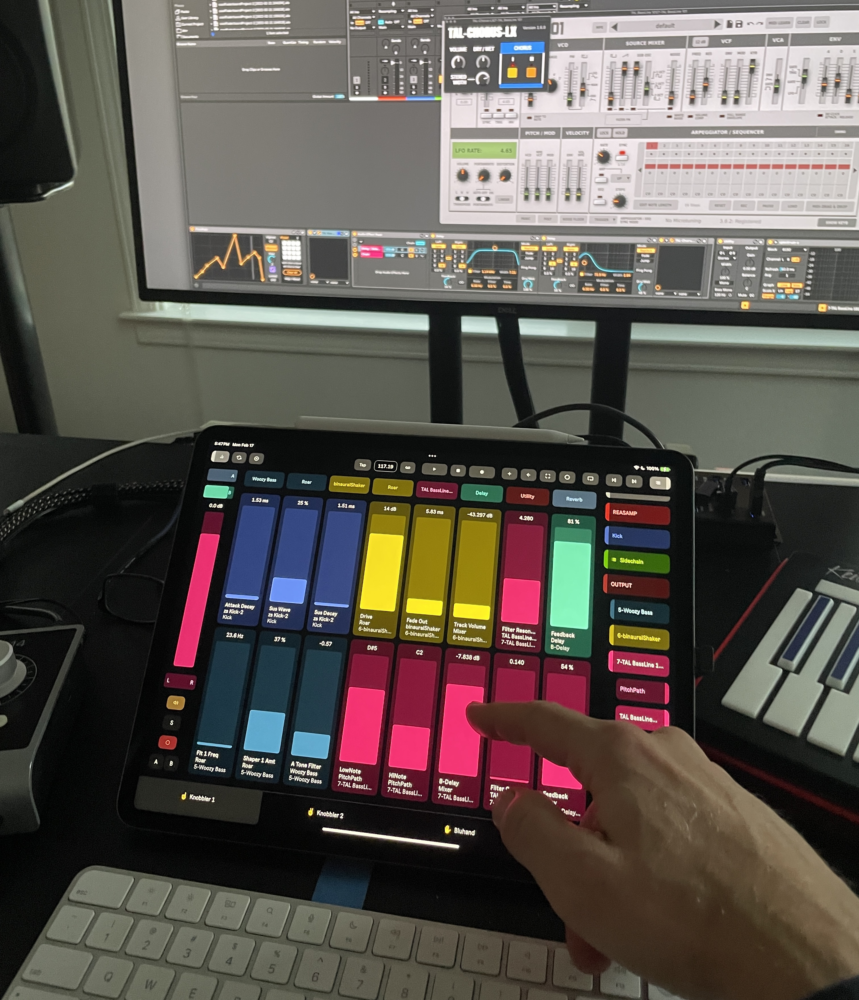

# Knobbler4

Knobbler4 turns your phone or tablet into an auto-labeling, auto-coloring, multitouch parameter control surface for Ableton Live. Add the Knobbler4 device to the Main track in your Live Set and use your tablet or mobile device to control devices and parameters.

Map parameters in your Ableton Live set to unmapped sliders on the tablet with a single touch. No need to enter and exit a mapping mode. Access every parameter in the currently selected device, directly on the tablet.

Parameter mapping configuration is saved with your Live Set, so you can switch between songs with minimal friction. Track, device, and parameter names are kept synchronized with your Live Set as you change them, even track colors!

Parameter sliders and values are updated in real time, with the same units (e.g. dB, ms, %) displayed as what you see in Live. Double tap a slider on the tablet to reset the parameter to its default value.

Quickly see and navigate around your tracks, groups, racks, chains, and devices with a touch.

Swipe out a channel strip to adjust the mixer settings of the currently selected track.

[Here is a playlist of videos featuring Knobbler4](https://www.youtube.com/playlist?list=PLqzTnRgmRId6cHDkhw_qqJL7dC67Qu440).

## [Knobbler Documentation Site](https://plugins.steinkamp.us/m4l-Knobbler4)

## Changelog

- 2025-06-25 [v36](https://github.com/zsteinkamp/m4l-Knobbler4/releases/download/v36/Knobbler4-v36.amxd) - Knobbler is now an Audio Device! Add to your Main / Master track. This release also adds CurrentParamKnob functionality to support forthcoming tablet + phone app update.
- 2025-05-26 [v35](https://github.com/zsteinkamp/m4l-Knobbler4/releases/download/v35/Knobbler4-v35.amxd) - Support multiple tablets by allowing for multiple Knobbler device instances with their own unique receive ports; Fix some initialization bugs that may have crashed the Android app.
- 2025-04-29 [v34](https://github.com/zsteinkamp/m4l-Knobbler4/releases/download/v34/Knobbler4-v34.amxd) - Removed Clips view support. Reliability improvements.
- 2025-04-20 [v33](https://github.com/zsteinkamp/m4l-Knobbler4/releases/download/v33/Knobbler4-v33.amxd) - Clips view support (beta)
- 2025-04-03 [v32](https://github.com/zsteinkamp/m4l-Knobbler4/releases/download/v32/Knobbler4-v32.amxd) - Support for sending rack macro variations and rack macro randomize; Check for device version updates and alert with a "!!" icon.
- 2025-03-16 [v31](https://github.com/zsteinkamp/m4l-Knobbler4/releases/download/v31/Knobbler4-v31.amxd) - Make Knobbler resilient to "forgotten" devices such as CC Control. These devices do not adhere to Ableton's API standard and thus misbehave with Knobbler. I have contacted support@ableton about this.
- 2025-03-05 [v30](https://github.com/zsteinkamp/m4l-Knobbler4/releases/download/v30/Knobbler4-v30.amxd) - Auto-collapse racks when collapsing them in the nav; Allow the app page to be automated; Toggle track children display; Revamp setup page; Center Bluhand labels'
- 2025-03-01 [v29](https://github.com/zsteinkamp/m4l-Knobbler4/releases/download/v29/Knobbler4-v29.amxd) - Eliminate the control surface requirement! More reliable navigation display.
- 2025-02-24 [v28](https://github.com/zsteinkamp/m4l-Knobbler4/releases/download/v28/Knobbler4-v28.amxd) - Fix bug where grouped tracks would be displayed at the end of the track list in the nav. Thanks Andrew C for the bug report.
- 2025-02-22 [v27](https://github.com/zsteinkamp/m4l-Knobbler4/releases/download/v27/Knobbler4-v27.amxd) - Fix bug related to navigating in tracks without devices. First release without TouchOSC template. Long live TouchOSC! All in on Knobbler for iPad now.
- 2025-02-19 [v26](https://github.com/zsteinkamp/m4l-Knobbler4/releases/download/v26/Knobbler4-v26.zip) - ACTUALLY Fix bug related to adding/removing VST parameters - ended up nicely simplifying parameter logic in Bluhand.
- 2025-02-19 [v25](https://github.com/zsteinkamp/m4l-Knobbler4/releases/download/v25/Knobbler4-v25.zip) - Fix bug related to adding/removing VST parameters - ended up nicely simplifying parameter logic in Bluhand
- 2025-02-18 [v24](https://github.com/zsteinkamp/m4l-Knobbler4/releases/download/v24/Knobbler4-v24.zip) - Watch `has_audio_output` more closely to enable/disable mixer controls appropriately. Thanks Andrew Norris for the bug report! Check out Andrew's stuff at https://andrewnorris.uk/
- 2025-02-16 [v23](https://github.com/zsteinkamp/m4l-Knobbler4/releases/download/v23/Knobbler4-v23.zip) - Detect control surfaces and show a warning if not present (required for Bluhand); Overhaul refresh system to be snappier and not get lost; Fix bug in exclusive arm code that would try to arm un-armable tracks and generate a warning in the Max console.
- 2025-02-14 [v22](https://github.com/zsteinkamp/m4l-Knobbler4/releases/download/v22/Knobbler4-v22.zip) - Support exclusive arm/solo
- 2025-02-13 ~~[v21](https://github.com/zsteinkamp/m4l-Knobbler4/releases/download/v21/Knobbler4-v21.zip) - Support channel mixer view in the native app; Direct mapping from Bluhand to Knobbler; Move more nav logic from the ipad app into the device for better performance and reliability; Imported Ableton's device parameter bank definitions from control scripts.~~
- 2025-02-05 [v20](https://github.com/zsteinkamp/m4l-Knobbler4/releases/download/v20/Knobbler4-v20.zip) - Handle collapsed tracks, stability improvements; ability to just refresh menu data.
- 2025-02-03 [v19](https://github.com/zsteinkamp/m4l-Knobbler4/releases/download/v19/Knobbler4-v19.zip) - Support device on/off; Pass device and rack types to native app; Cache device name lookups for Bluhand banks; Cache parent colors.
- 2025-02-01 [v18](https://github.com/zsteinkamp/m4l-Knobbler4/releases/download/v18/Knobbler4-v18.zip) - Adds automation state and enabled/disabled (green circle / greyed out) where appropriate; Make rack macro knobs share the layout they have on screen (two rows evenly divided).
- 2025-01-29 [v17](https://github.com/zsteinkamp/m4l-Knobbler4/releases/download/v17/Knobbler4-v17.zip) - Adds session record button state; Adds the Main channel to the Bluhand channel list.
- 2025-01-26 [v16](https://github.com/zsteinkamp/m4l-Knobbler4/releases/download/v16/Knobbler4-v16.zip) - More functionality for the native iPad app around browsing tracks and devices in your set, metronome toggle, tap tempo button, tempo text input. Limits macro sliders in Bluhand to the number of visible macros.
- 2025-01-22 [v15](https://github.com/zsteinkamp/m4l-Knobbler4/releases/download/v15/Knobbler4-v15.zip) - Adds functionality around play, stop, record, MIDI Overdub, Re-Enable Automation, Capture MIDI, Toggle Input Enable, Marker prev/next navigation, and Loop. This is all in support of the native iPad app.
- 2025-01-21 [v14](https://github.com/zsteinkamp/m4l-Knobbler4/releases/download/v14/Knobbler4-v14.zip) - Fixes a critical bug in v13 that prevented Knobbler knob mapping from working.
- 2025-01-20 v13 - Support features in the native iPad app: Bank buttons, track/device navigation buttons (DOWNLOAD DISABLED - BUGFIX IN v14 ABOVE)
- 2025-01-12 [v12](https://github.com/zsteinkamp/m4l-Knobbler4/releases/download/v12/Knobbler4-v12.zip) - New more compact tabbed UI; Bluhand device presets now in the UI; Fix bug with shortcut buttons that could make re-opening a set assign the buttons incorrectly; Curated parameter banks for some stock Live devices (not done); Use live.banks for Max for Live devices on Bluhand; Fix small bug in bluhand that was emitting errors into the console.
- 2025-01-04 [v11](https://github.com/zsteinkamp/m4l-Knobbler4/releases/download/v11/Knobbler4-v11.zip) - Fix bugs in Bluhand: 1) values would not sync unless the slider was touched 2) double-tap did not return to default; Implement `/syn` handler, responds with `/ack` to enable improved setup UI in the native app.
- 2024-12-20 [v10](https://github.com/zsteinkamp/m4l-Knobbler4/releases/download/v10/Knobbler4-v10.zip) - Fix a bug in Current Param Knob that displayed garbled value strings and sometimes led to a crash. Thanks @rds2024-3004 for reporting the bug!
- 2024-12-04 [v9](https://github.com/zsteinkamp/m4l-Knobbler4/releases/download/v9/Knobbler4-v9.zip) - Simplify main patch with a JS-based OSC router; Fix bug around button param vals; Fix CurrentParamKnob warnings when no param is selected; Bundle versioned TouchOSC template in the zip.
- 2024-12-01 [v8](https://github.com/zsteinkamp/m4l-Knobbler4/releases/download/v8/Knobbler4-v8.zip) - Fixes a bug that would affect recall if a track or device was moved.
- 2024-11-30 [v7](https://github.com/zsteinkamp/m4l-Knobbler4/releases/download/v7/Knobbler4-v7.zip) - Use the chain color/name instead of the track's if the parameter's device is in a rack.
- 2024-11-28 [v6](https://github.com/zsteinkamp/m4l-Knobbler4/releases/download/v6/Knobbler4-v6.zip) - Fixes Issue #10 reported by @rds2024-3004 which prevented multiple knobs mapped to the same parameter from being updated. This led to some more widespread fixes/improvements to how locks are implemented across the board.
- 2024-10-29 [v5](https://github.com/zsteinkamp/m4l-Knobbler4/releases/download/v5/Knobbler4-v5.zip) - Add non-blocking telemetry ping on load. Does not send any identifying information, only the plugin name, the local computer name, type of computer, and CPU type. I just want to see which plugins are used the most.
- 2024-10-24 [v4](https://github.com/zsteinkamp/m4l-Knobbler4/releases/download/v4/Knobbler4-v4.zip) - Add assignable device presets to Bluhand.
- 2024-10-12 [v3](https://github.com/zsteinkamp/m4l-Knobbler4/releases/download/v3/Knobbler4-v3.zip) - Fix bug related to slider 25 masquerading as slider 15; Typography refinement in the .tosc file; Consolidate back to a single `Knobbler4.tosc` file (Bluhand is back, baby!); Fix value display in Bluhand if the value was a bare number; Fix bug with changing devices in Bluhand if you were not on bank 1, the display would be incorrect. _NOTE: Use the Files app on the iPad to delete the `.tosc` files before updating with the new version from here._
- 2024-09-22 [v2](https://github.com/zsteinkamp/m4l-Knobbler4/releases/download/v2/Knobbler4-v2.zip) - Re-adds Bluhand functionality, double-tap a slider to return to the default value. Make sure you update the `.tosc` files on your iPad when downloading this update!
- 2024-09-08 [v1](https://github.com/zsteinkamp/m4l-Knobbler4/releases/download/v1/Knobbler4-v1.zip) - Initial release.

## Development

See the docs at [the m4l-typescript-base repo](https://github.com/zsteinkamp/m4l-typescript-base) for instructions on how to develop in this device.

## TODOs

- ...

## Feedback Welcome!

Please let me know if you have any stories, good or bad, about your Knobbler4 experience. I'd love to hear your feedback and ideas of how to make it better! zack@steinkamp.us
