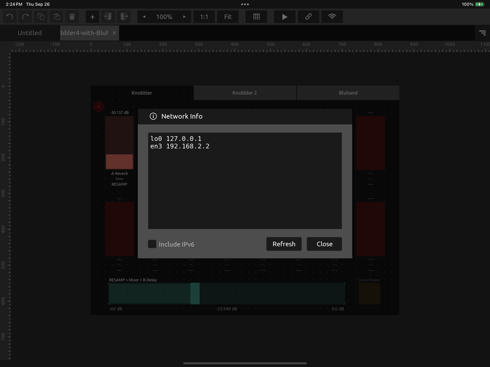
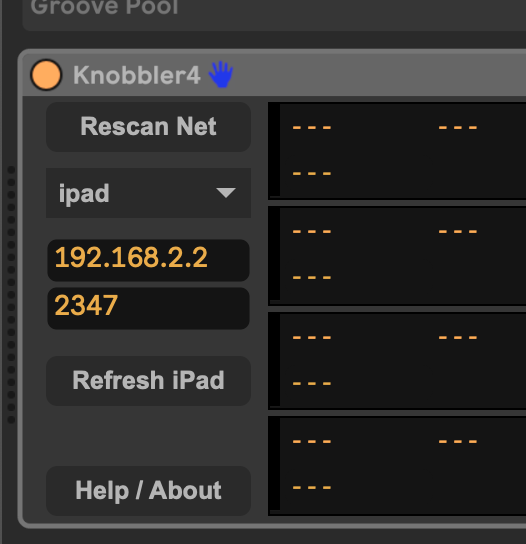

## Configuring a Mac-to-iPad Connection over USB

Sometimes WiFi is not the best choice. The goal of these instructions is to get
you running with a USB connection between a Mac and an iPad.

Because OSC is a network-based protocol, we need to make the iPad think it is on the same network as the Mac. To do this, we will use the Internet Sharing feature of Mac OS.

### Step-By-Step

1) On the iPad, turn off Wi-Fi
2) Connect the iPad to the Mac via USB cable
3) On the Mac, open the Internet Sharing settings.
4) In the "Share your connection from" drop-down, choose "Wi-Fi".
5) In the "To devices using" list, enable "iPad USB".
   
6) Slide the big switch at the top to enable Internet Sharing.
7) Click "Done".
8) On the Mac, open Ableton Live and add the Knobbler4 device to your Live Set.
9) On the iPad, open TouchOSC. Click the "Chain" icon to open the Connection Settings.
10) Tap the "OSC" tab in the Connection Settings page.
11) Tap "Browse" next to the "Host" box. Your computer should show up there next to " - Knobbler4".
    
12) Tap that name and choose the IPv4 address that shows up. In this case it's `192.168.2.1:2346`.
13) Tap the (i) icon next to the Receive Port. This will show the IP address of the iPad. In this screenshot, it is `192.168.2.2`.
    
14) Back in Ableton Live, in the Knobbler4 device, enter the iPad's IP address into the host box.
    
15) Click "Refresh iPad".

