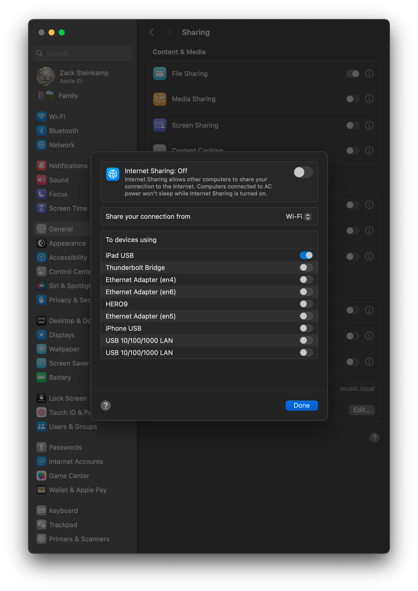

## Configuring a Mac-to-iPad Connection over USB

Sometimes WiFi is not the best choice. The goal of these instructions is to get
you running with a USB connection between a Mac and an iPad.

Because OSC is a network-based protocol, we need to make the iPad think it is on the same network as the Mac. To do this, we will use the Internet Sharing feature of Mac OS.

> This path is recommended for those with good experience configuring their network, since the auto-discovery features of Knobbler are not available on the USB connection.

### Step-By-Step

1. On the iPad, turn off Wi-Fi
2. Connect the iPad to the Mac via USB cable
3. On the Mac, open the Internet Sharing settings.
4. In the "Share your connection from" drop-down, choose "Wi-Fi".
5. In the "To devices using" list, enable "iPad USB".
   
6. Slide the big switch at the top to enable Internet Sharing.
7. Click "Done".
8. On the Mac, open Ableton Live and add the Knobbler4 device to your Live Set.
9. In the Knobbler app, go to the Settings page.
10. Pull down to refresh the list. Your computer should show up there next to " - Knobbler4".
    
11. Tap that name.
12. Back in Ableton Live, in the Knobbler4 device, enter the iPad's IP address into the host box. You can get the IP from the Network Settings in the iPad.
    
13. Click "Refresh iPad".

At this point, Knobbler should be fully functional.
