## Features

Read all about Knobbler's features in detail here. You can use the navigation on the right to jump to different parts of this long document.

* [Feature Walkthrough Video (10 min)](https://www.youtube.com/watch?v=Be4O1vaxjxU)

### Knobbler Knobs

Knobbler's knobs are pretty self-explanatory. They're very high-resolution (500 steps) and operate at a latency that is lower than MIDI. The full multitouch capabilities of the iPad are at your fingertips.

#### Knob States

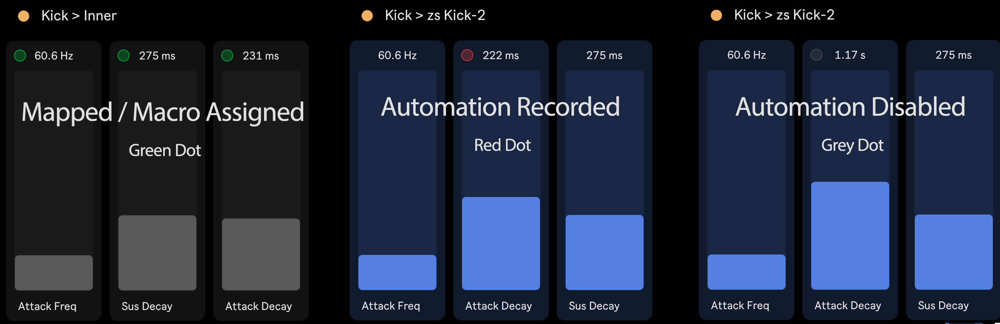

Knobbler knobs indicate their state with a dot in the upper left corner, similar to how it is presented in Ableton Live.

* Green Dot = The parameter is controlled by another device, or is mapped to a macro knob. The slider will also be greyed out.
* Red Dot = Automation has been recorded for this parameter.
* Grey Dot = Automation has been overridden for this parameter (i.e. automation was recorded, but the parameter was changed manually.) Tap the Re-Enable Automation button in the toolbar to re-enable the automation.
    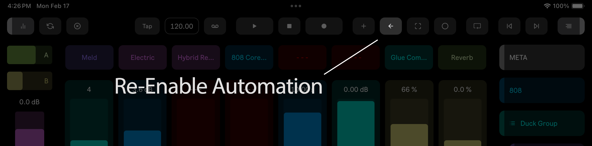

### Knobbler Pages

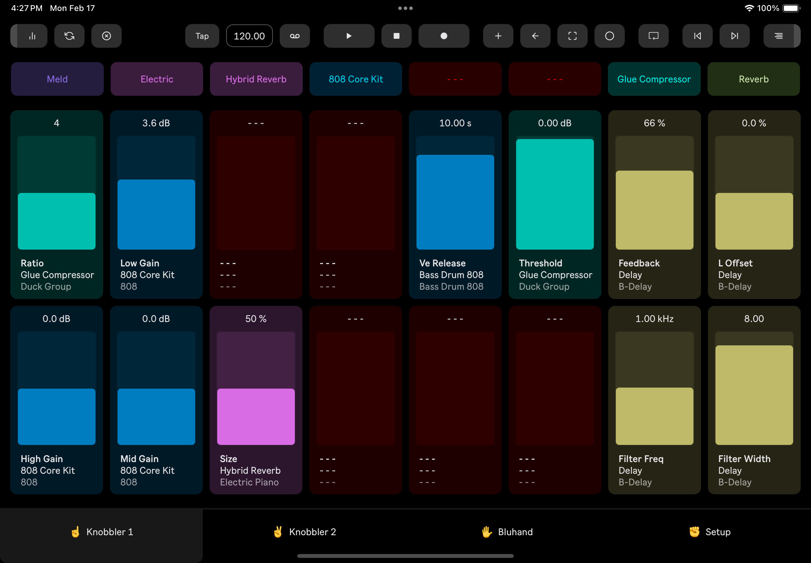

This was Knobbler's first feature -- as a page of sliders that you can map to whatever you like. If you'd like to read the history of Knobbler, [check it out!](https://steinkamp.us/posts/2022-03-16-knobbler)

There are two ways to map a Knobbler slider.

#### Mapping 1: Selected Param

The original way is to click a parameter on the computer screen, which highlights that parameter by highlighting its corners.

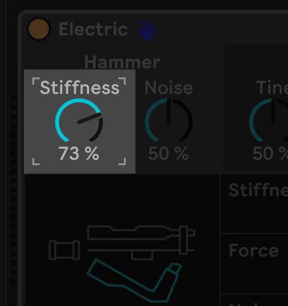

Then tap any unassigned Knobbler slider, and the mapping is done. No modes to enter or exit, and the control remains available to be controlled with the mouse or modulated by another device in the set.

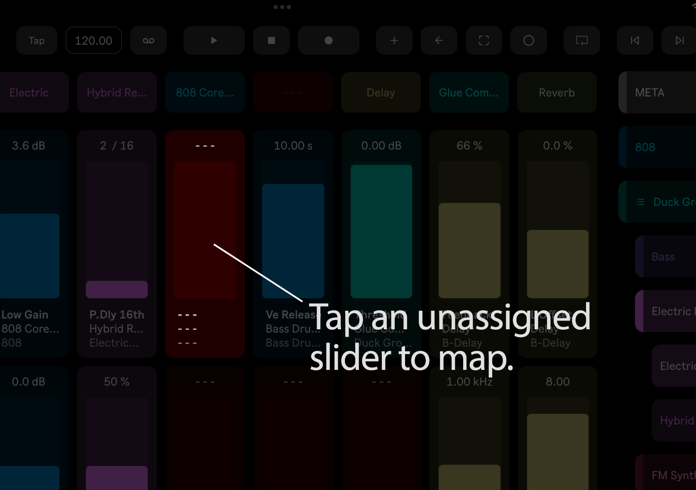

#### Mapping 2: Direct from Bluhand

The other way to map a Knobbler slider is from the Bluhand page.

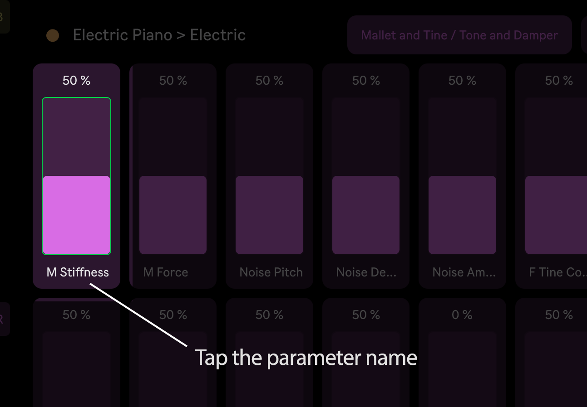

On the Bluhand page, tap a parameter name. The parameter's slider will get a green outline.

Then go to a Knobbler page. All of the sliders will be highlighted in green. Tap any of them (even one that is already mapped) and it will be replaced.

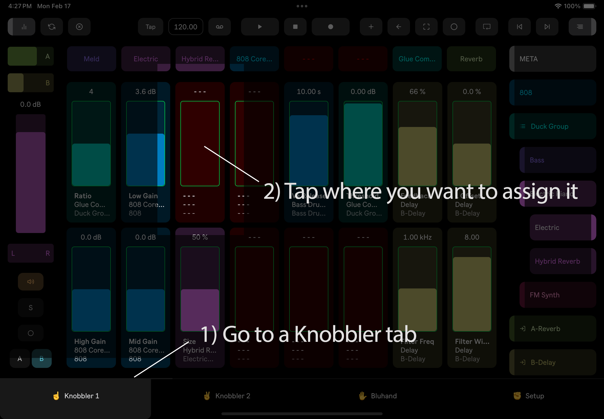

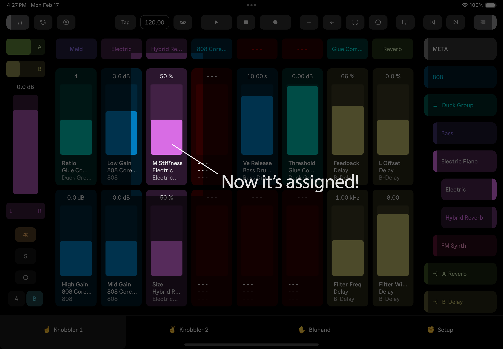

The Knobbler mappings are saved with the Live Set, making recall instant, and enabling you to work on many songs at once without having to remember "what does this knob do???"

#### Unmapping

To unmap a Knobbler slider, tap the Unmap button in the [Toolbar](#toolbar). All of the Knobbler sliders will get a red outline. Tap the slider(s) you wish to unmap, then tap the Unmap button again to exit unmapping mode.

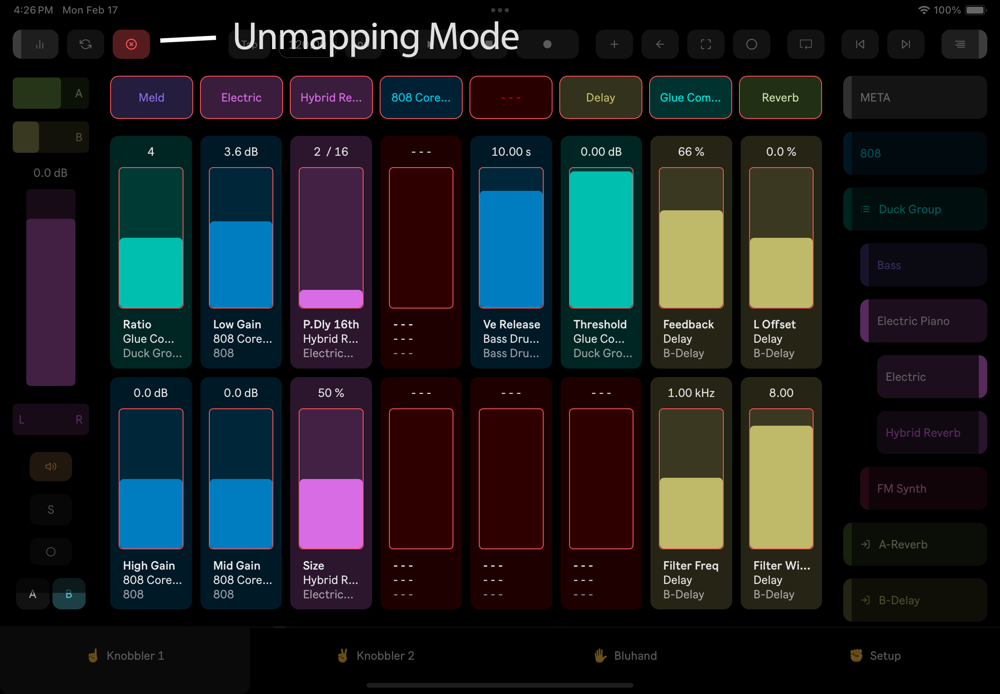

#### Default Value

All sliders in Knobbler respond to a double-tap by resetting the parameter to its default value. Double-tap to default.

#### Select Track

If you tap the track name under the Knobbler slider, that will select that track in Live, which will update the channel strip on the left side of the screen. This is a convenient way to access the mixer controls for a parameter you have mapped.

### Bluhand Page

Bluhand gives you a parameter-focused view of the currently selected device.

Parameter banks are shown above the sliders. In the case of racks, Variations controls are shown.

The device can be toggled off and on with the orange button next to the device title.

> Make sure you do not turn off the Knobbler device! Otherwise you will have to turn it back on using the mouse. :)

#### Default Value

All sliders in Knobbler respond to a double-tap by resetting the parameter to its default value. Double-tap to default.

#### Variations Support

When a Rack is selected, the space normally used for Parameter Banks changes to show Variations controls.

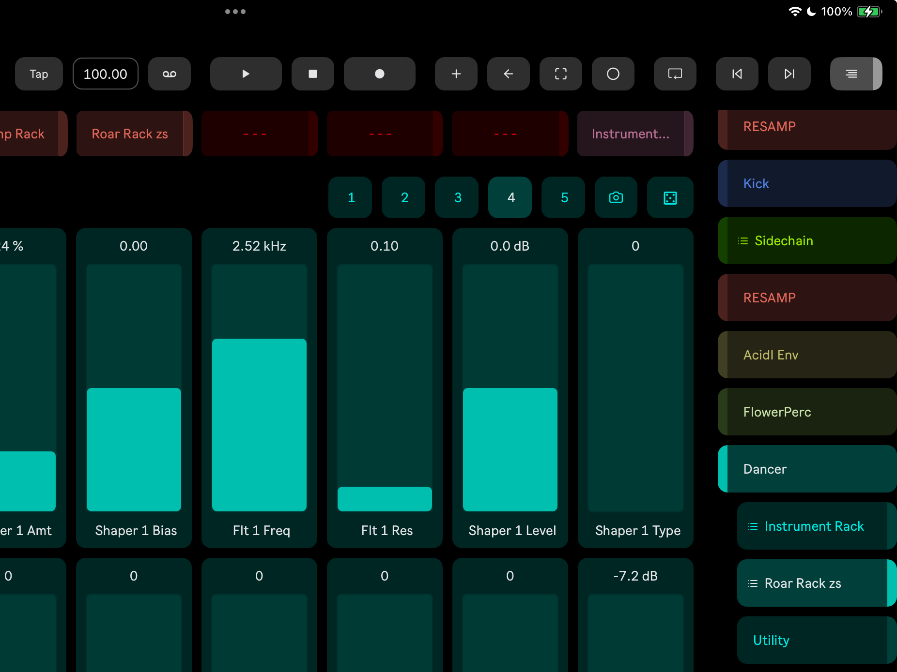

Stored variations are shown with the numbered buttons. Unfortunately, Ableton Live does not provide apps like Knobbler access to the variation name.

The selected variation is shown with a brighter button.

Tap the Camera icon to store a new variation.

Tap the Dice icon to randomize the Rack's Macro controls.

#### Fast Mapping to Knobbler

Tap a parameter name on a Bluhand slider to enter Knobbler mapping mode. The slider above that parameter name will get a bright green border. Then if you visit the Knobbler 1 or Knobbler 2 page, every slider there will have the same green border. Tap one of those sliders to map that parameter to that Knobbler fader. Fast!

Step by step:

On the Bluhand page, tap a parameter name. The parameter's slider will get a green outline.

Then go to a Knobbler page. All of the sliders will be highlighted in green. Tap any of them (even one that is already mapped) and it will be replaced.

### Device Shortcuts

Toward the top of the Knobbler and Bluhand pages, there are eight buttons that you can use to instantly jump to the most important devices in your Live Set.

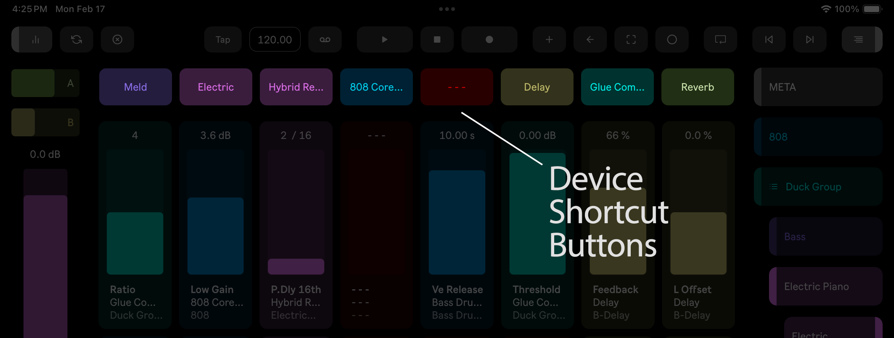

#### Mapping

With the device you would like to map to a button shown in the Bluhand page, tap an unassigned button. You're done!

#### Unmapping

Tap the Unmap button in the toolbar to enter Unmapping mode. All of the shortcut buttons will be given a red border.

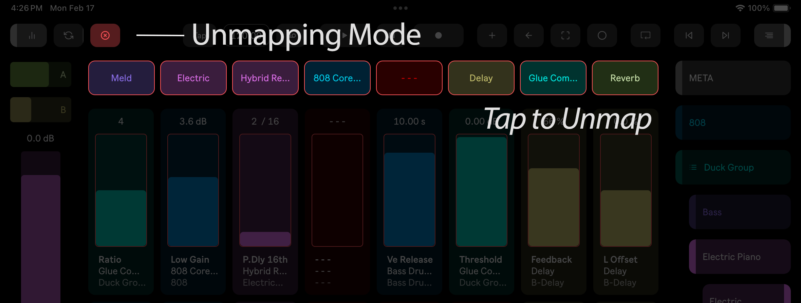

Tap any of the buttons to unmap them.

Tap the Unmap button again to exit Unmapping mode.

#### Using the Shortcut Buttons

Regardless of whether you are on a Bluhand or Knobbler page, tapping a shortcut button will take you to the Bluhand page with that device selected.

### External Hardware

You can use Knobbler with external hardware in conjunction with a device like the `CC Control` device that comes with Live 12. Note that as of what is shipped in Live 12.1, `CC Control` has a defective API implementation and does not work properly with Knobbler. Until that device is fixed, you can download and use my free device called [MIDI CC Bridge](https://plugins.steinkamp.us/m4l-MIDI-CC-Bridge).

### Navigation

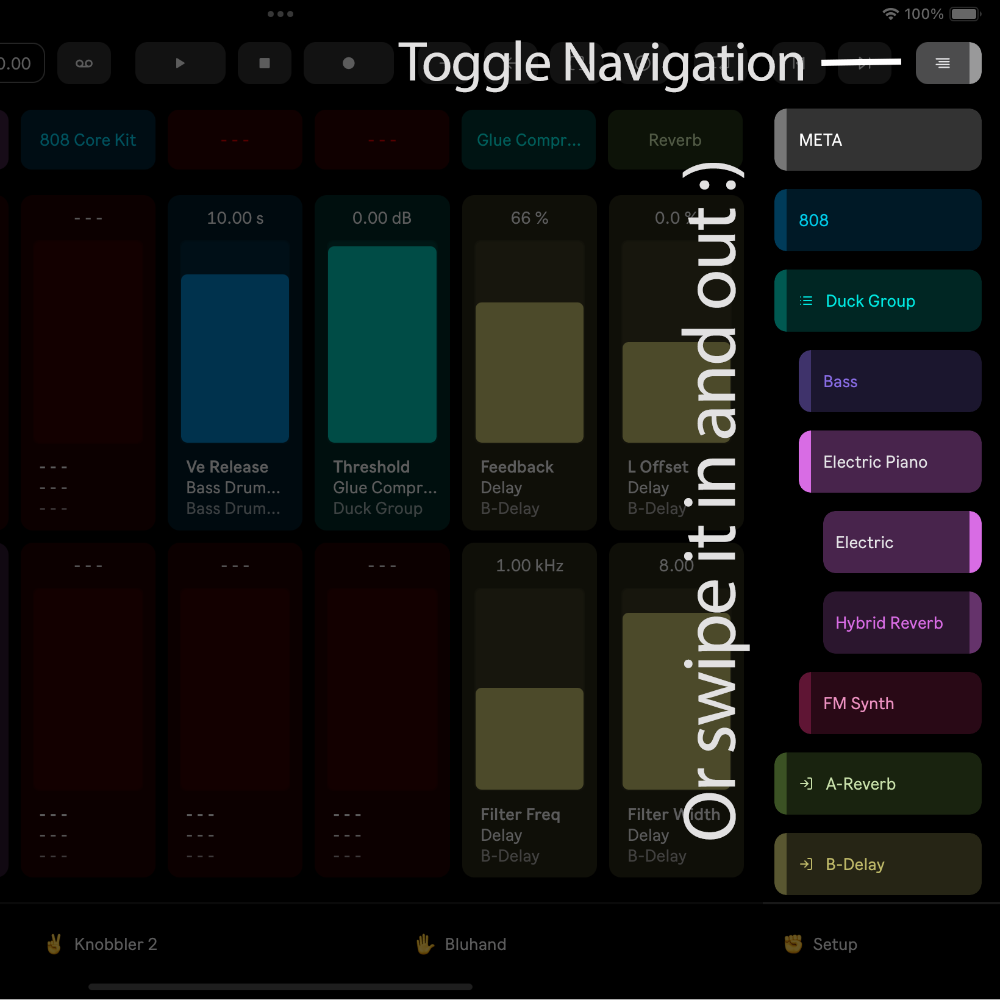

Move around your Live Set with more speed and ease than ever before!

Tap a track to open it. Tap a device to select it and show its parameters in the Bluhand page.

Tracks have a highlight on their left edge, devices are highlighted on the right.

Group tracks and racks are indicated with a list icon. Tap a Rack to show its chains. Tap a chain to see devices inside that chain.

Sometimes track colors or names may get out of sync. Tap the Refresh button in the Toolbar to fix this.

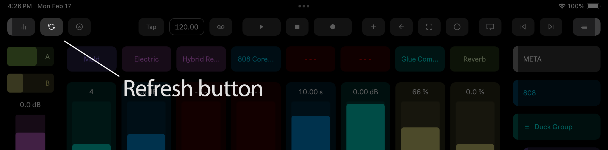

### Channel Strip

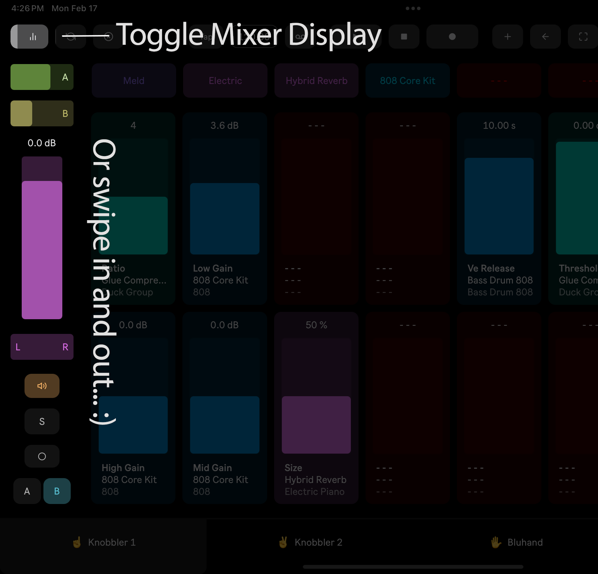

Take full control over the mixer controls for the currently selected track.

Tap the button to show the Channel Strip, or swipe it in from the left side.

#### Sends

Each send track in your set is represented, including its color. If there is not enough space to display all of the sends, then you can swipe up and down to scroll between them.

Slide left and right to increase or decrease the amount sent.

#### Volume

This is the mixer volume for the track. Its color will be the same as the selected track color.

#### Pan

Slide left and right to control the pan position.

#### Mute

Toggle whether the track is muted.

#### Solo

Toggles the track's solo state. Respects the user preference around exclusive solo.

#### Record Arm

Tap to toggle this track's record arm state. Respects the user preference around exclusive arm.

#### Toggle Record Enable

A long press on the Record Arm button will disable input entirely. This is useful if you are in Arrangement view and you want to record automation over existing MIDI clips and you do not want to change the clips. Otherwise, the MIDI clips are all merged into a single clip and it gets annoying. Tap the record arm button again to re-enable inputs and arm the track for recording.

#### Crossfader Controls

On tracks and return tracks, an `A` or `B` button are shown, which allows you to assign that track to one side of the crossfader or another.

If you select the Main track, the `A`/`B` buttons are replaced with a crossfader slider.

#### Default Value

All sliders in Knobbler respond to a double-tap by resetting the parameter to its default value. Double-tap to default.

### Toolbar

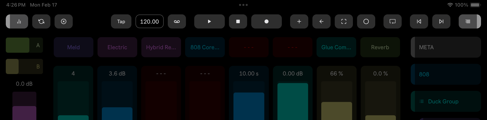

Knobbler's toolbar echoes a lot of the items Ableton Live's toolbar, with some Knobbler-specific additions.

#### Show / Hide Channel Strip Mixer

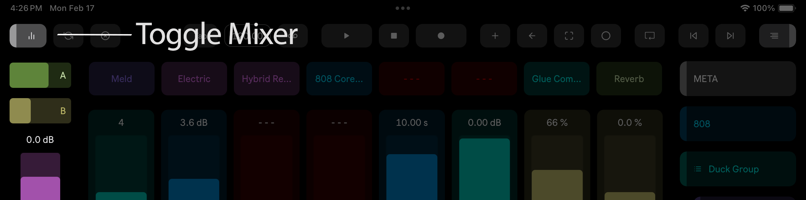

Toggle the appearance of the channel strip on the left edge of the screen. You can also swipe sideways from the edge to show and hide it.

#### Refresh Display

Requests an update of all data from the computer.

#### Unmapping Mode

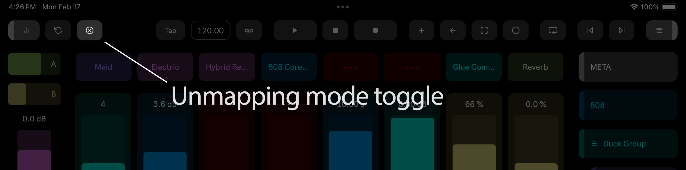

This button toggles Unmapping mode on and off. When Unmapping mode is engaged, then Knobbler sliders and Shortcut buttons have a red border. Tap the slider or button to unmap it.

#### Tempo Section

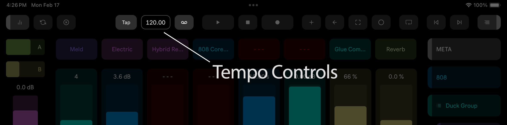

Tap tempo, tempo display and editing, and metronome control.

#### Transport Controls

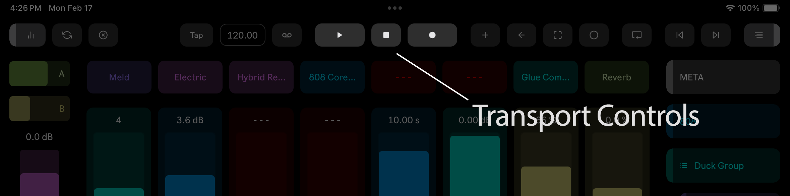

Play, stop, and record.

Pressing `Stop` a second time will send the playhead to the beginning of the song. Pressing a third time will silence anything that is playing.

The record button respects the "Start Transport With Record" preference.

#### Overdub MIDI

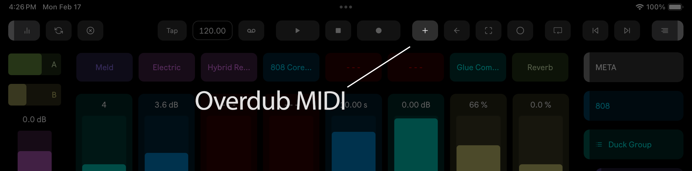

When enabled, recorded MIDI data is merged with existing MIDI clips. When disabled, recorded MIDI data will replace existing clips.

#### Re-Enable Automation

If automation is recorded for a parameter, but that parameter is manually adjusted, the automation will be disabled and shown in grey. Click this button to re-enable the automation everywhere that it is disabled.

#### Capture MIDI

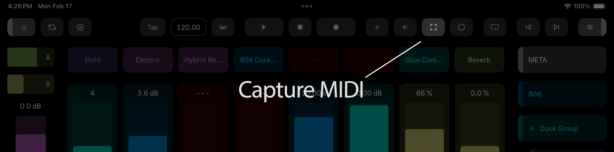

Perhaps the most under-appreciated feature of many DAWs. Click this button to capture all MIDI data captured since changing tracks. This is a great way to be noodling into some inspiration and not have to stop and record, which usually loses some of that zesty mojo.

#### Session Automation Overdub

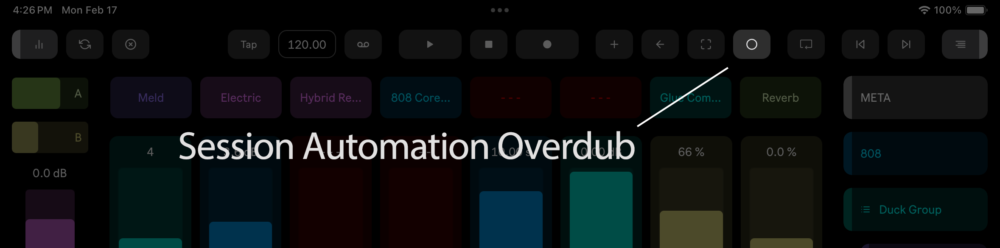

When enabled, any automation moves made while session clips are playing is recorded into the clip. This is an awesome way to build layers of evolution into your sounds.

#### Loop

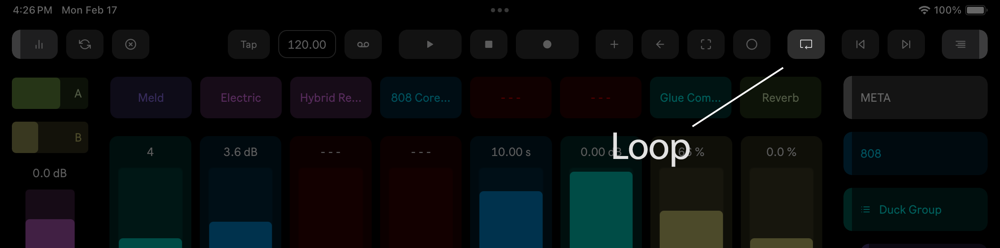

Toggle whether the Arrangement view transport loop is enabled.

#### Previous / Next Locator

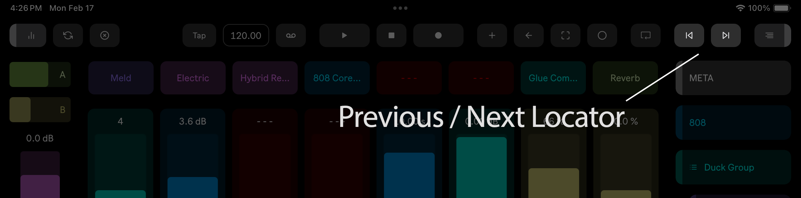

These buttons allow you to navigate to locators in your Live Set. The beginning of the song and the loop ending point are default locators.

#### Show / Hide Navigation

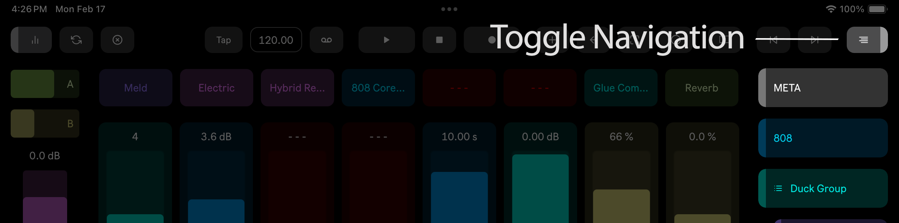

Toggles the display of the Navigation widget on the right side of the screen. You can also swipe in from the side to show it, and swipe from its left edge to hide it.

### Setup Page

This is the page where you will tell Knobbler how to find its counterpart on your computer. Knobbler advertises itself on your network, so setup should be easy.

#### Connections

You can input an IP address and port number if you like to do things the hard way, or you can select a computer from the list and the host/port will be filled in.

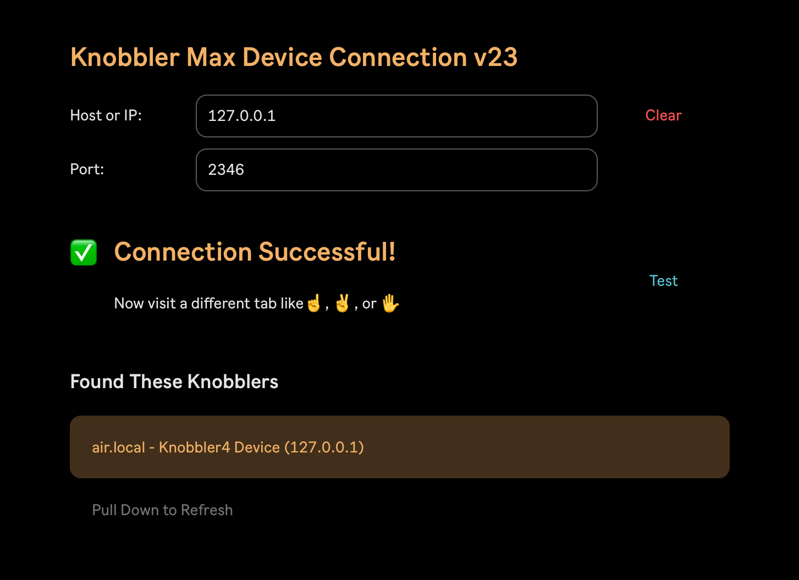

Tap the `Clear` button to reset the fields.

If no hosts are found on the network running the Knobbler device, a message will be shown that includes a button to download the Knobbler device.

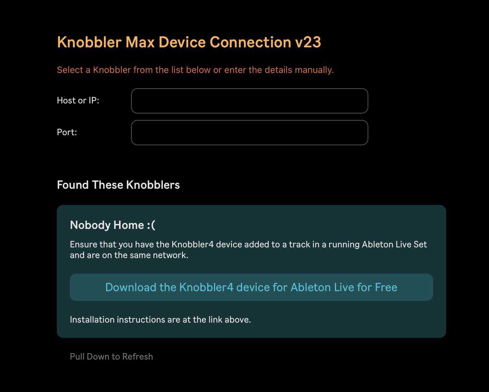

#### Version Checks

If the Knobbler device that the app is communicating with is too old, a warning message will be shown. This message also includes a link to download the latest Knobbler device.
