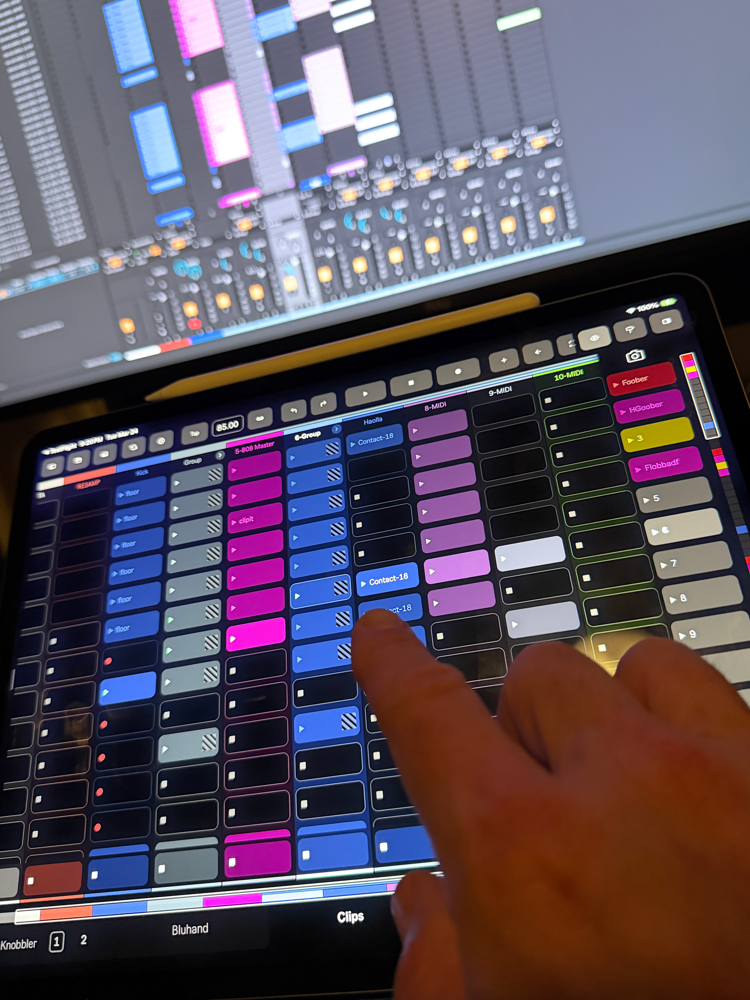
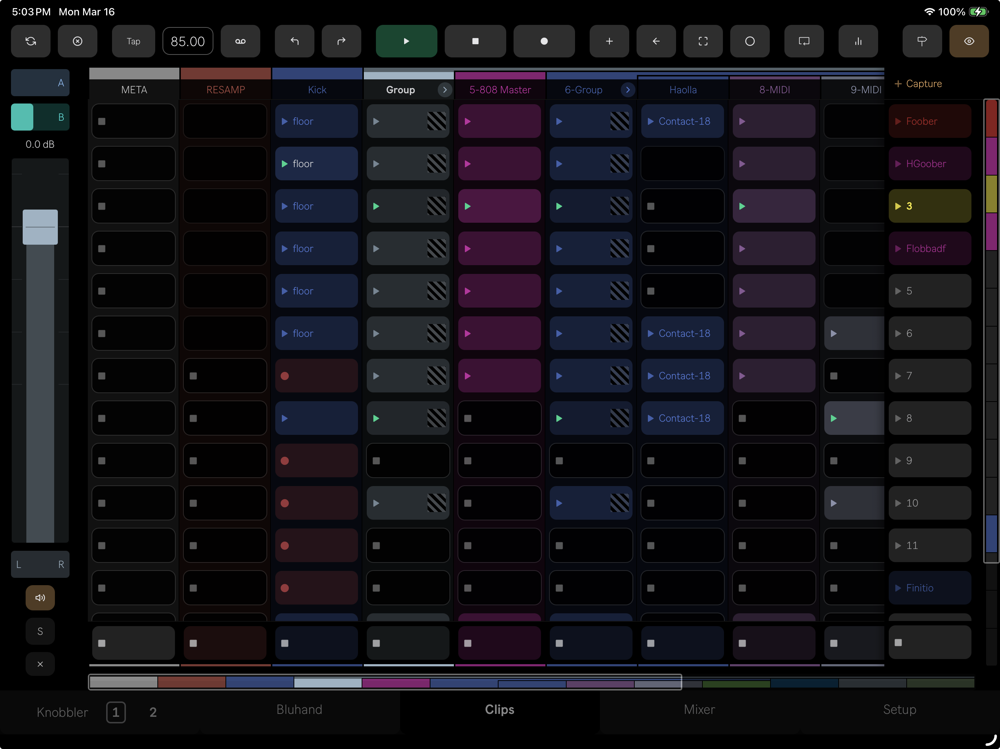
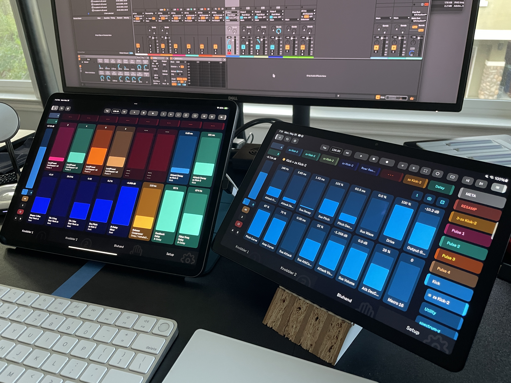
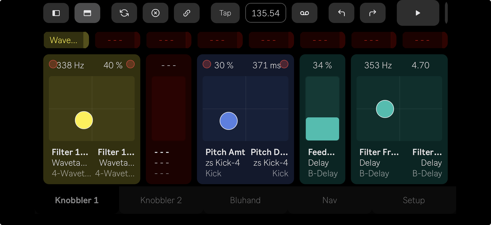

## Gallery

Knobbler in the wild — studios, stages, and setups from the community.

### Session View

The combined Session page — clips grid and multi-track mixer with real-time meters, all at your fingertips.

### Clips in Action

Launching and managing clips directly from the iPad, with Ableton's arrangement visible on the monitor behind.

### Clip Grid

The full clip grid with sidebar mixer strip, scene list, and navigation panel.

### Multi-Device Setup

Two iPads running Knobbler side by side — Knobbler sliders on one, Bluhand device parameters on the other, with Ableton on the monitor above.

### Mixer on Phone

The full multi-track mixer fits right in your hand.

### X-Y Pads on Phone

Joined X-Y pads on the Knobbler page in landscape mode — great for filter sweeps and effects control.

### The Battle Station

My personal setup — Knobbler front and center on a 13" iPad and Push working together.

### Your Photo Here

If you've got a great shot of Knobbler in the wild, send it to me! [zack@steinkamp.us](mailto:zack@steinkamp.us).
