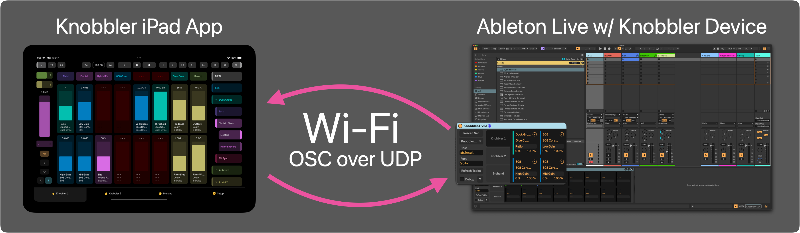
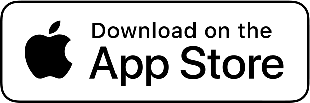

## Knobbler4 - The Best Parameter Control Surface For Ableton Live

### ** Knobbler for iOS is Half Off until 2026! **

Get your Knobbler on for $19.99 USD for a Lifetime license, $9.99 for an annual subscription.

<iframe width="100%" style="border: 20px solid black; aspect-ratio: 16 / 9" src="https://www.youtube.com/embed/PY_IKedjfz8?si=Hk_QRJ88DjPkZhfU" title="YouTube video player" frameborder="0" allow="accelerometer; autoplay; clipboard-write; encrypted-media; gyroscope; picture-in-picture; web-share" referrerpolicy="strict-origin-when-cross-origin" allowfullscreen></iframe>

- [Setup Video (5 min)](https://www.youtube.com/watch?v=IXMD_2z16_A)
- [Feature Walkthrough Video (10 min)](https://www.youtube.com/watch?v=Be4O1vaxjxU)

[Download Knobbler for iPhone and iPad in the App Store](https://apps.apple.com/us/app/knobbler/id6740183923)

[Check out Knobbler for Android in the Google Play Store](https://play.google.com/store/apps/details?id=com.anonymous.knobblernative)

[Knobbler Subreddit](https://www.reddit.com/r/knobbler/)

[History of Knobbler](https://steinkamp.us/posts/2025-03-01-knobbler)

Knobbler is an iOS and Android app that communicates with a Max device that you add to your Live Set. It requires a compatible phone or tablet (iOS and Android) and a computer running Live 12 Suite or Standard (with Max for Live add-on), able to communicate directly with one another over a network.

Knobbler keeps you in the creative moment in your musicmaking by giving you fingertip access to the tracks, devices, and parameters in your Live Sets that matter the most.

It's an auto-labeling, auto-coloring, bidirectional control surface that you can customize for each song. Pick back up right where you left off with perfect recall, so you can work on several songs at once, each with their own ideal layout, saved inside the song file itself.

### Main Features

- Two pages of **16 assignable, auto-labeling, auto-coloring, high-resolution faders** that always show you exactly what is happening in your music.
- A page dedicated to **all of the parameters** of the currently selected device. Parameter banks are labeled, and just a touch away.
- Support for storing, recalling, and generating random **Variations** in Instrument, Audio Effect, and MIDI Racks.
- Eight **device shortcut buttons** to jump directly to the most important devices in your Live Set.
- An innovative **navigation system** that lets you dive through your tracks, groups, racks, chains, and devices faster than you can click a mouse.
- A **mixer channel strip** for the currently selected track, giving you control over volume, mute, solo, record, send levels, and even the crossfader.
- **Direct access** to familiar buttons from Live's toolbar, such as tap tempo, capture MIDI, and of course, transport controls.
- Support for **multiple tablets** with multiple Knobbler device instances.

### Download

Visit the Apple App Store on your iPhone or iPad to purchase and install the Knobbler app. Just search for Knobbler or click this button.

For Android users, get Knobbler in the [Google Play Store](https://play.google.com/store/apps/details?id=com.anonymous.knobblernative).

Then download the latest Knobbler device for Ableton Live. Click the blue device download button below...

### Release Notes / Changelog

View the complete release changelog and download old versions on the [GitHub Releases page](https://github.com/zsteinkamp/m4l-Knobbler4/releases).

### Installation

- Unzip the downloaded device file
- Drag the Knobbler-vXX.amxd file (where XX is the most recent version) to the User Library in Ableton Live
- Now you can add the device to any of your Live Sets
  - The device is required to communicate with the mobile app
  - The Main track is a good place for it.

Next, visit [Setup](./setup.md) or explore Knobbler's [Features](./features.md).

### Content Creators

If you're a content creator and want to use or feature Knobbler in a video or post, please get in touch with me. I'm happy to send you a Promo Code so that you can use/get Knobbler for free. Email me at zack@steinkamp.us. Cheers!
