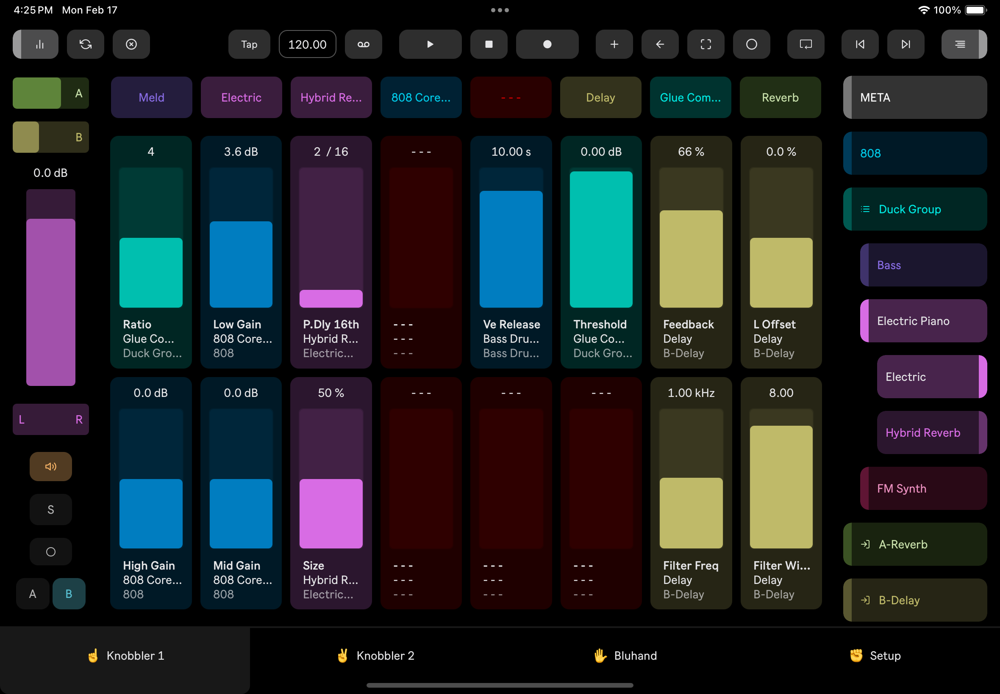

## Knobbler4 - The Best Parameter Control Surface For Ableton Live

<< Download unit ... device button | app store link >>

Knobbler keeps you in the creative moment in your musicmaking by giving you fingertip access to the tracks, devices, and parameters in your Live Sets that matter the most.

It's an auto-labeling, auto-coloring, bidirectional control surface that you can customize for each song. Pick back up right where you left off with perfect recall, so you can work on several songs at once, each with their own ideal layout, saved inside the song file itself.

### Main Features

* Two pages of **16 assignable, auto-labeling, auto-coloring faders** that always show you exactly what is happening in your music.
* A page dedicated to **all of the parameters** of the currently selected device. Parameter banks are labeled, and just a touch away.
* Eight **device shortcut buttons** to jump directly to the most important devices in your Live Set.
* An innovative **navigation system** that lets you dive through your tracks, groups, racks, chains, and devices faster than you can click a mouse.
* A **mixer channel strip** for the currently selected track, giving you control over volume, mute, solo, record, send levels, and even the crossfader.
* **Direct access** to familiar buttons from Live's toolbar, such as tap tempo, capture MIDI, and of course, transport controls.

### Requirements

Knobbler is an iPad app that communicates with a Max device that you add to your Live Set. It requires an iPad and a computer running Live 12 Standard or Live 12 Suite, able to communicate directly with one another over a network.

<< diagram Knobbler iPad app <-> Knobbler Max device in your Live Set >>

### Download

Download the latest Knobbler device for Ableton Live.
<< download button >>
Visit the Apple App Store on your iPad to purchase and install the Knobbler app. Just search for Knobbler or click this button.
<< app store button >>

### Installation

* Unzip the downloaded device file
* Drag the Knobbler-vXX.amxd file (where XX is the most recent version) to the User Library in Ableton Live
* Now you can add the device to any of your Live Sets
  * The device is required to communicate with the iPad app

Next, visit [Setup](./setup) or explore Knobbler's [Features](./features).
