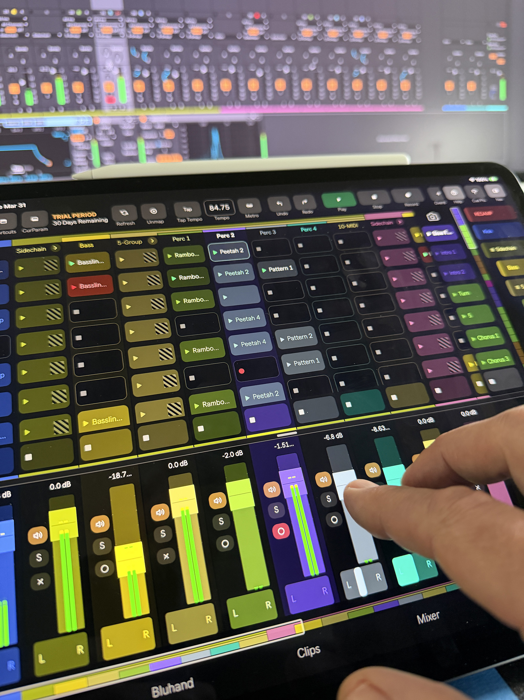
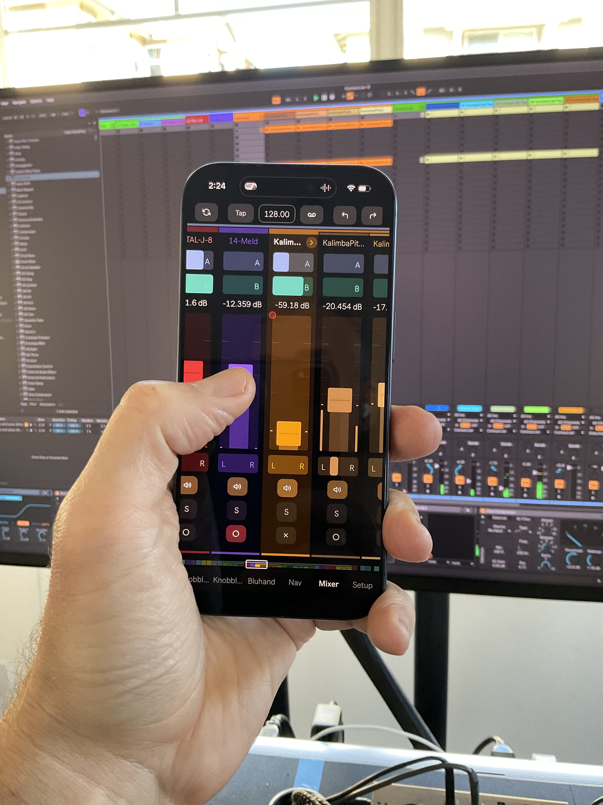
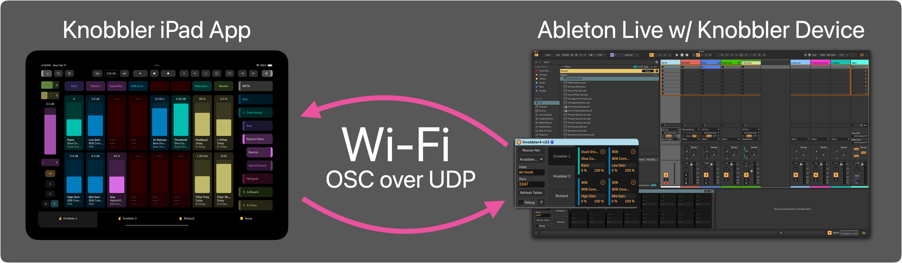

## Knobbler4 - The Best Control Surface for Ableton Live on Your iPad, iPhone, or Android

<iframe width="100%" style="border: 20px solid black; aspect-ratio: 16 / 9" src="https://www.youtube.com/embed/PY_IKedjfz8?si=Hk_QRJ88DjPkZhfU" title="YouTube video player" frameborder="0" allow="accelerometer; autoplay; clipboard-write; encrypted-media; gyroscope; picture-in-picture; web-share" referrerpolicy="strict-origin-when-cross-origin" allowfullscreen></iframe>

- [Setup Video (5 min)](https://www.youtube.com/watch?v=IXMD_2z16_A)
- [Setup and Feature Walkthrough Video (15 min)](https://www.youtube.com/watch?v=m3h8QtVeWb8)

Knobbler keeps you in the creative moment by giving you fingertip access to what matters most in your music. Turn your phone or tablet into a multitouch control surface for Ableton Live -- map parameters, mix tracks, and launch clips without ever leaving the flow.

Every mapping is saved with your Live Set. Pick up right where you left off, work on several songs at once, each with their own ideal layout.

### People Are Saying...

> It really is an exemplary piece of design that fuels, rather than distracts from, the creative process. — **steve99**

> Knobbler is by far the best app I've paid for in a very long time. It brings out everything Live has to offer without requiring yet another slab of controller plastic on my desk. — **u/FaderJockey2600**

[More testimonials →](./testimonials.md)

 

[More photos →](./gallery.md)

### Features

- **32 assignable faders** across two pages. Auto-labeling, auto-coloring, high-resolution, and always showing you exactly what is happening in your music. Pair any two faders into an **X-Y pad** for two-dimensional control, or flip on **Spring mode** to make any slider momentary.
- **Bluhand** -- a dedicated page with all of the parameters of the currently selected device. Parameter banks are labeled and just a touch away. Store, recall, and randomize **Variations** in Racks.
- **Full-screen mixer** -- volume, pan, mute, solo, arm, sends, and real-time meters for every track in your set. Scrollable, with send controls for every return track.
- **Session view clip grid** -- Launch, record, rename, and color clips and scenes.
- **Current parameter display** -- always see the name, value, device, and track of whatever parameter you last touched in Live.
- **Navigation** -- dive through your tracks, groups, racks, chains, and devices faster than you can click a mouse.
- **Device shortcuts** -- eight buttons to jump directly to the most important devices in your Live Set.
- **Toolbar** -- tap tempo, capture MIDI, transport controls, and more.
- **Multi-device support** -- use multiple phones and tablets simultaneously with multiple Knobbler instances.

Read more about all of Knobbler's features in the [Features](./features.md) page, and check out [Knobbler Tips](./tips.md) for getting the most out of it.

### How It Works

Knobbler is an iOS and Android app that communicates with a Max for Live device in your Live Set. All you need is a compatible phone or tablet and a computer running Live 12 Suite or Standard (with Max for Live), connected over WiFi or ethernet.

### Get Knobbler

**iOS** (iPhone and iPad) -- [Download from the App Store](https://apps.apple.com/us/app/knobbler/id6740183923)

Free download with a 30-day unlimited trial. Then choose monthly ($0.99), annual ($9.99), or one-time Lifetime ($19.99).

**Android** (phones and tablets) -- [Download from Google Play](https://play.google.com/store/apps/details?id=com.anonymous.knobblernative)

One-time purchase, $14.99. Due to a Google Play limitation, a trial period is not available on Android.

**Ableton Live device** -- After getting the app, download the latest Knobbler4 device using the blue download button at the top or bottom of this page.

### Installation

1. Drag the Knobbler-vXX.amxd file to the User Library in Ableton Live.
2. Add the device to any Live Set (the Main track is a good place for it).

Next, visit [Setup](./setup.md) to get connected.

### Resources

- [Knobbler Subreddit](https://www.reddit.com/r/knobbler/)
- [Knobbler Discord](https://discord.com/channels/1340693019552387072/1433825749055569980)
- [History of Knobbler](https://steinkamp.us/posts/2025-03-01-knobbler)
- [Release Notes / Changelog](https://github.com/zsteinkamp/m4l-Knobbler4/releases)

### Content Creators

Want to feature Knobbler in a video or post? Get in touch and I'll send you a Promo Code. Email me at zack@steinkamp.us.
