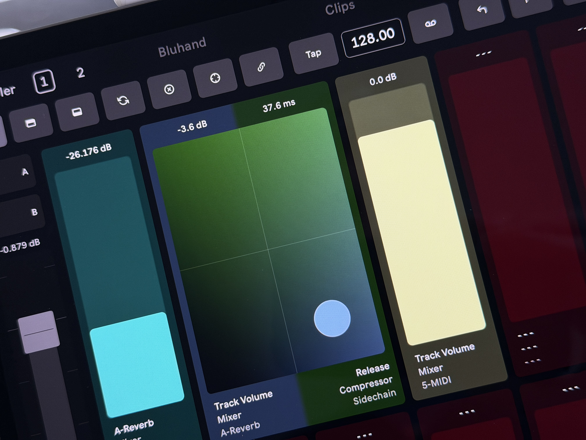
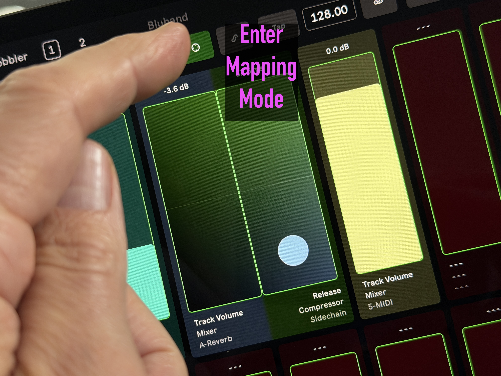
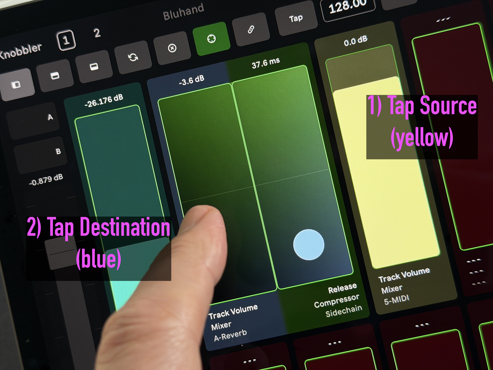
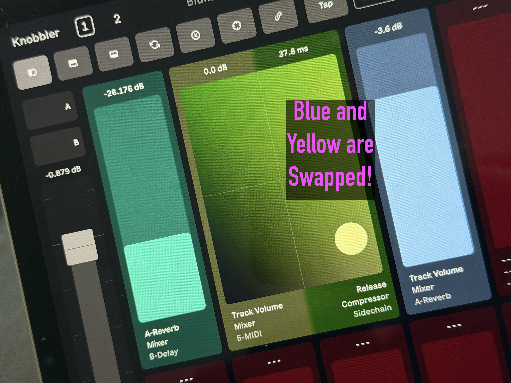

## Mapping Mixer & Bluhand Controls to Knobbler Sliders

Mapping Mode lets you take any mixer control (volume, pan, sends, mute,
crossfader) or any Bluhand device parameter and assign it to a Knobbler slider.
This gives you a single, custom page of the exact controls you reach for most —
a track's volume next to a reverb's decay next to a synth's filter cutoff — all
on one screen.

> Requires Knobbler4 device **v60 or later** and a compatible app version.

### How It Works

You pick a **source** (the control you want to map) and a **target** (the
Knobbler slider it should live on). The app walks you through it.

#### 1. Tap the Map button

On any page, tap the crosshair (⊕) button in the toolbar to enter Mapping Mode.

#### 2. Pick a source

Every mappable control gets a green outline to show it can be a source. On the
Mixer page, that's the volume, pan, send, mute, and main track crossfader:

Tap the control you want to map. Here we're grabbing the **4-Audio** track's
volume. It will start blinking:

Bluhand device parameters work as sources too — just navigate to the Bluhand
page while armed and tap the parameter slider you want:

> **Shortcut:** On the Bluhand page you can skip the Map button entirely — tap a
> parameter's **name** to begin a mapping with that parameter as the source.

#### 3. Go to a Knobbler page

The Map button stays lit (armed) after you pick a source. Switch to a Knobbler
page to choose where the control should go:

#### 4. Pick a target slider

Valid target sliders are outlined in green. Tap the slot you want to map the
source onto:

That's it — the slider is now mapped, labeled with what it controls, and colored
to match its track. Mapping Mode turns off automatically.

### Rearranging sliders with Swap

Mapping Mode also lets you **swap two Knobbler sliders** — pick up the mapping
on one slider and drop it onto another to trade their positions. This is the
fastest way to tidy up a page: group related controls together, move a
frequently-used parameter to a more comfortable spot, or shuffle an XY pad
without re-mapping anything.

Here's a Knobbler page with three controls — a teal slider, a blue XY pad, and a
yellow slider:

#### 1. Enter Mapping Mode

Tap the crosshair (⊕) button in the toolbar.

#### 2. Tap the source, then the destination

Tap the slider you want to move — it gets a **flashing green outline** to show
it's selected. Every valid destination shows a **steady green outline**; tap the
one you want to swap it with.

#### 3. Done — the two are swapped

The source and destination trade places, keeping their labels, colors, and
ranges. Mapping Mode turns off automatically.

> **Move vs. swap:** if the destination slider is empty, this is a *move* — the
> source ends up on the destination and its old slot is left empty. If both
> sliders are mapped, it's a true *swap*.
>
> **XY pads survive a swap.** Because an XY pad is just two slots grouped
> together, swapping a parameter into one half of a pad keeps the pairing intact
> — only the parameter shown changes. (A *move* that would leave a pad half-empty
> splits the pad back into two separate sliders.)

### Notes

- Tap the Map button again at any point to cancel and exit Mapping Mode without
  making an assignment.
- Mapping onto a slider that's already in use simply replaces the old
  assignment.
- Mapped controls behave exactly like any other Knobbler slider — the label,
  color, value string, and automation indicator all update to reflect the
  control you mapped.
