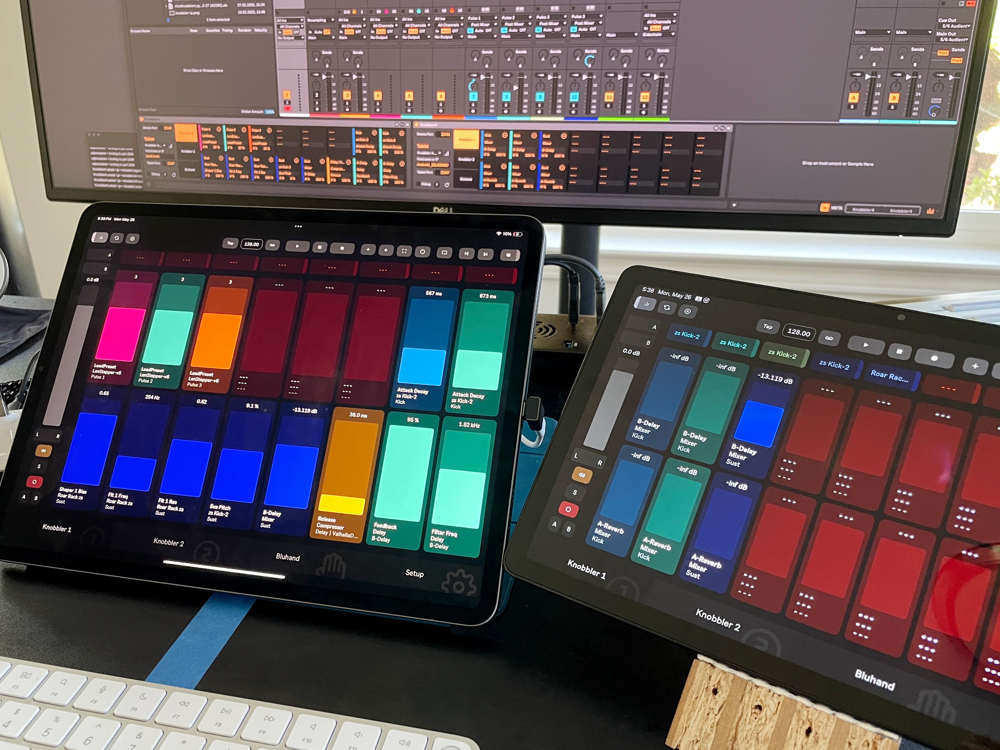

## Using Multiple Tablets with Knobbler

It is possible to use more than one tablet by using more than one instance of Knobbler.

### Tablet #1

1. Open the Knobbler app on Tablet #1.
1. Add the Knobbler device to a track in your Live Set.
1. Change the `Device Port` number to `2345`.
1. Select Tablet #1 from the tablet drop-down.
1. On Tablet #1, go to the Setup screen and refresh the list. Select the Knobbler device with port `2345`. If one does not appear, then just enter the port number manually above.

### Tablet #2

5. Open the Knobbler app on Tablet #2
6. Add another instance of the Knobbler device
7. Do not change the Device Port (i.e. leave it at its default of `2346`)
8. Select Tablet #2 from the drop-down.
9. On Tablet #2, go to the Setup screen and refresh the list. Select the Knobbler device with port `2346`. If one does not appear, then just enter the port number manually above.
