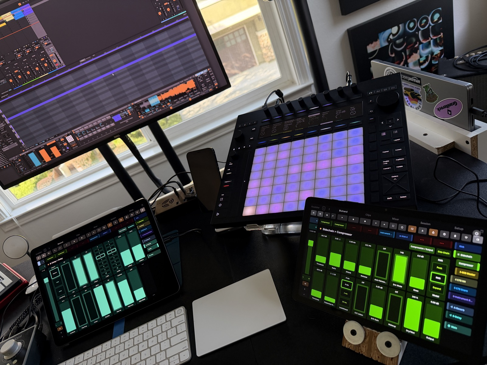

## Using Multiple Tablets and Phones with Knobbler

It is possible to use more than one tablet or phone at the same time by running more than one instance of the Knobbler device. Each instance is fully independent — its own port, its own mappings, and (see below) its own current track and device — so several surfaces can drive a single Live Set simultaneously.

Above: two iPads — one on the mixer, one on a device page — plus a Push, all controlling the same Live Set at the same time.

### Independent focus per surface

By default every Knobbler surface follows Live's **selected track and device**, so they all show the same thing and stay in sync with what's selected on screen. That's ideal for a single player.

For multiple surfaces at once, each instance can instead hold its **own** current track and device, independent of Live's selection and of the other surfaces. Tap the **Follow Sel** button in the toolbar to toggle:

- **Locked (default, lock icon):** the surface follows Live's selected track/device, and selecting a track/device on the surface also selects it in Live — the original two-way behavior.
- **Unlocked (unlock icon):** the surface keeps its own current track/device. Navigating on that tablet — the nav panel, mixer header, a slider's track name, device shortcuts — retargets *only that surface* and does **not** move Live's on-screen selection.

So one player can ride the mixer while another tweaks a synth's macros and a third drives an effect rack — each on their own tablet, none stepping on the others' selection. The lock state and the chosen track/device persist with the Live Set per instance, so each surface comes back where you left it.

> Requires a Knobbler device and app version that support the focus feature (the **Follow Sel** button appears in the toolbar when both are recent enough).

### Setting up each instance

Each instance exposes a Live parameter named **Device Port**, so you can give each one a unique port from anywhere you can change Live parameters — even on [Push 3 Standalone](./push3-standalone.md).

#### App #1

1. Open the Knobbler app on your first tablet or phone.
1. Add the Knobbler device to a track in your Live Set.
1. Change the `Device Port` number to `2345`.
1. Select App #1 from the tablet drop-down.
1. On the same tablet or phone, go to the Setup screen and refresh the list. Select the Knobbler device with port `2345`. If one does not appear, then just enter the port number manually above.

#### App #2

5. Open the Knobbler app on your second tablet or phone.
6. Add another instance of the Knobbler device.
7. Do not change the Device Port (i.e. leave it at its default of `2346`).
8. Select App #2 from the drop-down.
9. On the second tablet or phone, go to the Setup screen and refresh the list. Select the Knobbler device with port `2346`. If one does not appear, then just enter the port number manually above.
