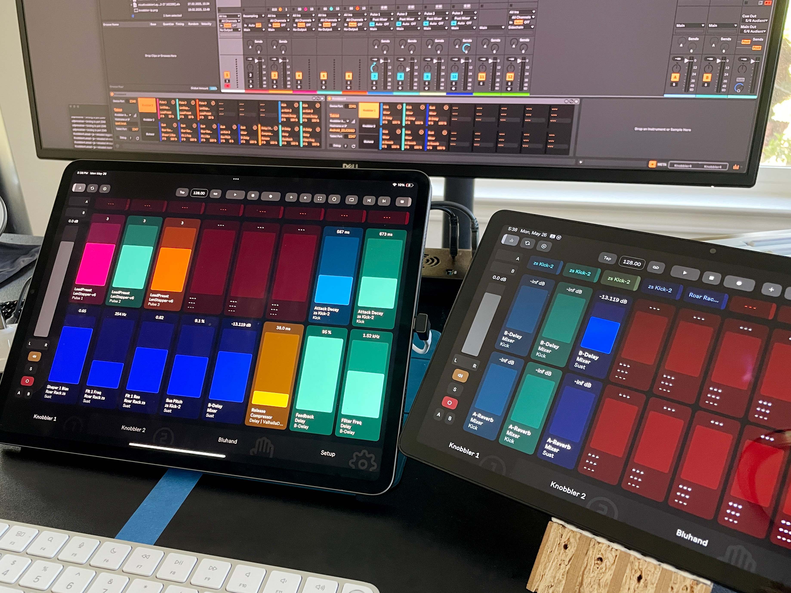

## Using Multiple Tablets and Phones with Knobbler

It is possible to use more than one tablet or phone by using more than one instance of the Knobbler device. Each instance exposes a Live parameter named **Device Port**, so you can give each instance a unique port from anywhere you can change Live parameters — even on [Push 3 Standalone](./push3-standalone.md).

### App #1

1. Open the Knobbler app on your first tablet or phone.
1. Add the Knobbler device to a track in your Live Set.
1. Change the `Device Port` number to `2345`.
1. Select App #1 from the tablet drop-down.
1. On the same tablet or phone, go to the Setup screen and refresh the list. Select the Knobbler device with port `2345`. If one does not appear, then just enter the port number manually above.

### App #2

5. Open the Knobbler app on your second tablet or phone.
6. Add another instance of the Knobbler device.
7. Do not change the Device Port (i.e. leave it at its default of `2346`).
8. Select App #2 from the drop-down.
9. On the second tablet or phone, go to the Setup screen and refresh the list. Select the Knobbler device with port `2346`. If one does not appear, then just enter the port number manually above.
