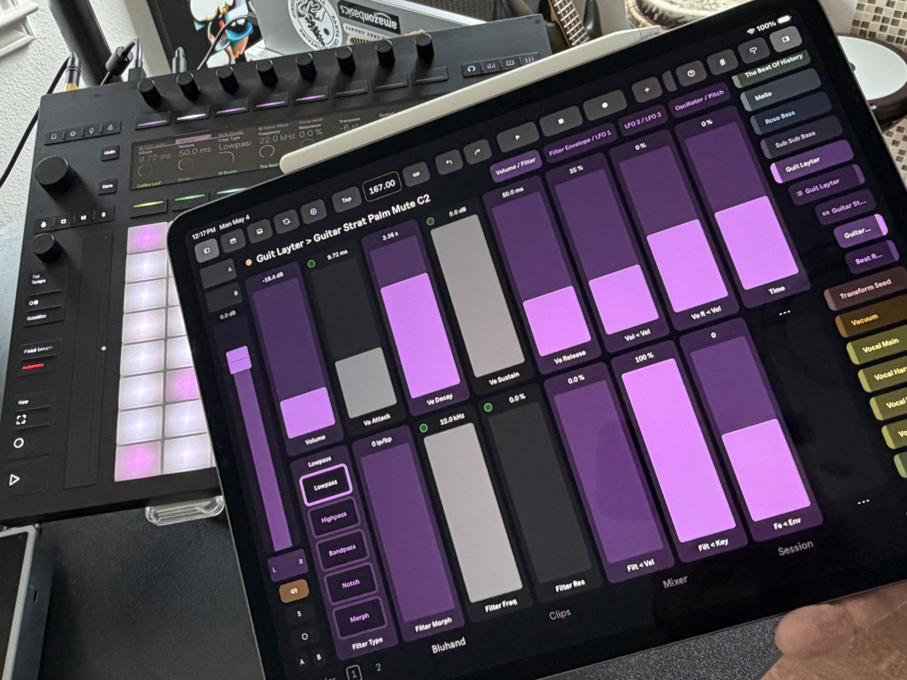
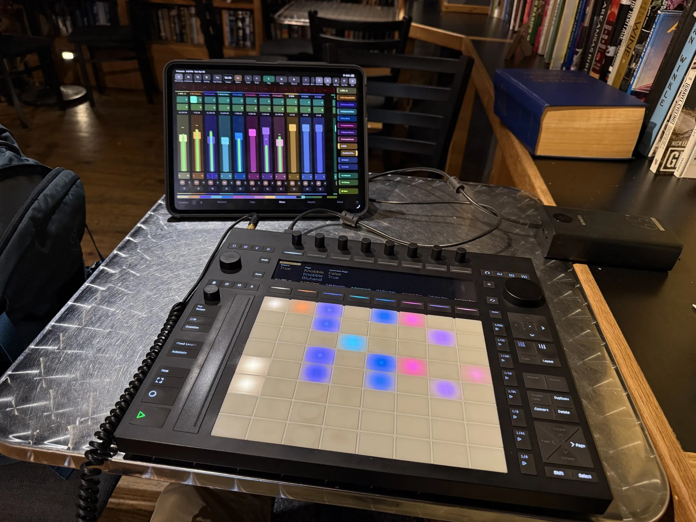
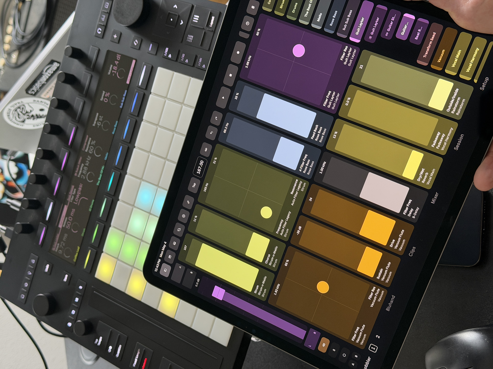
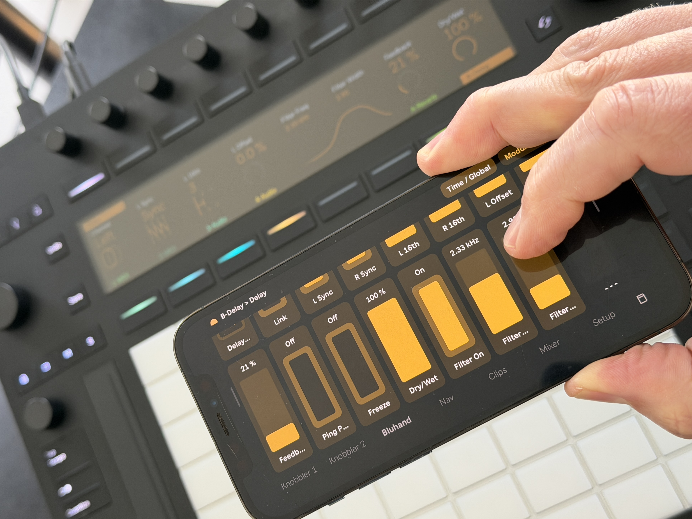
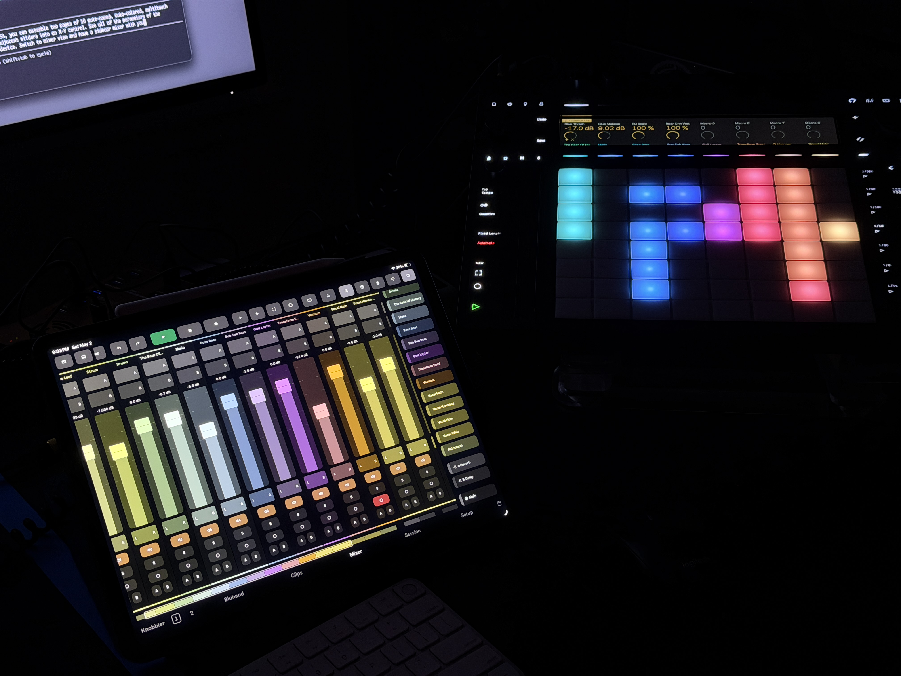
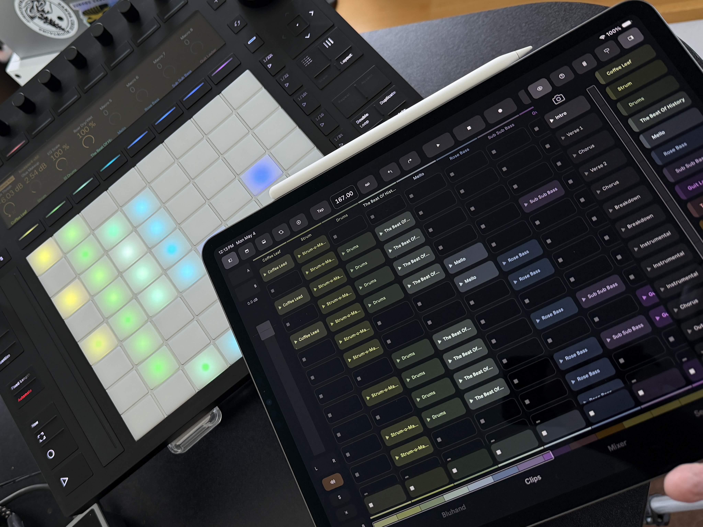
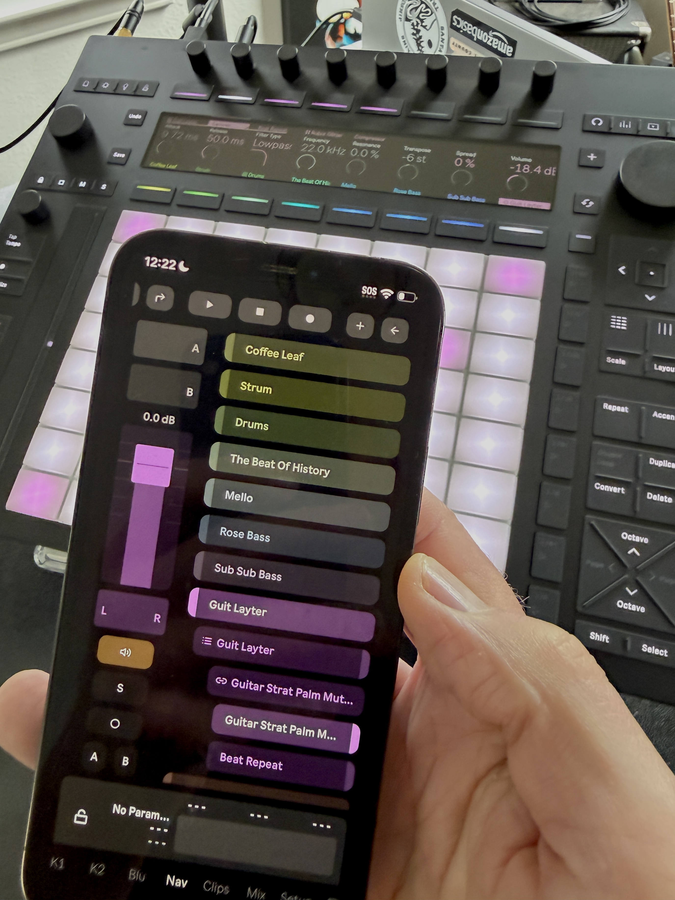
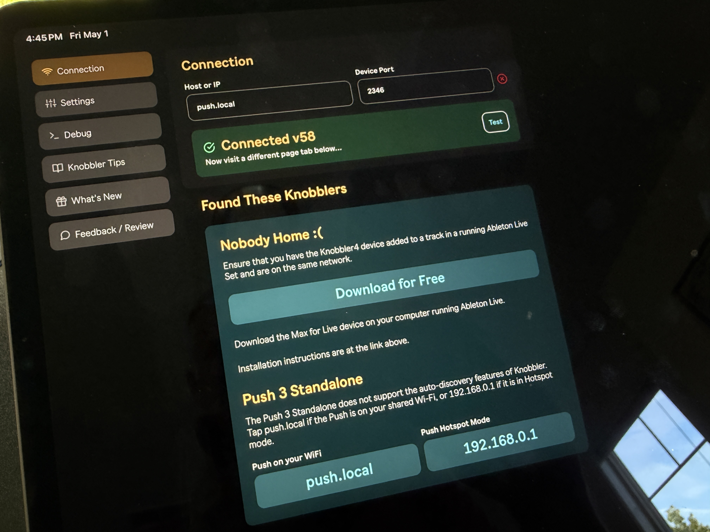
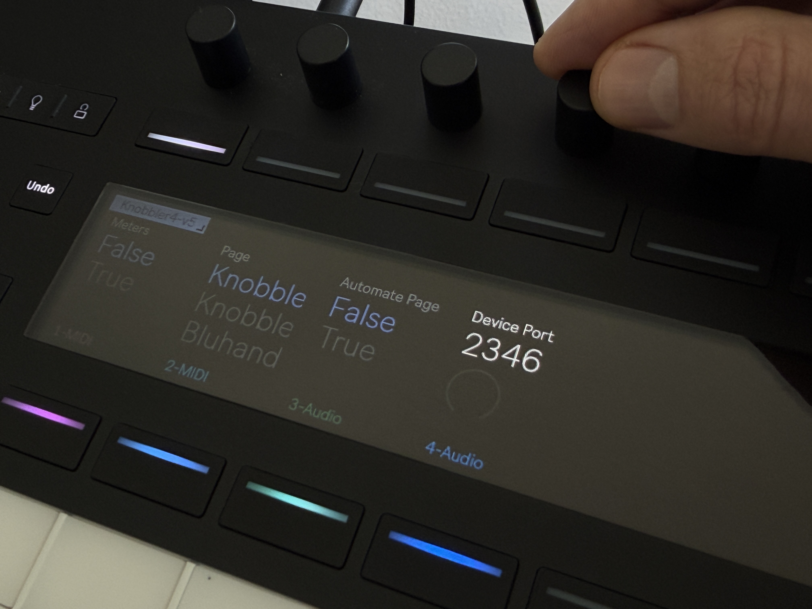

## Push 3 Standalone

 

Knobbler runs on the Push 3 Standalone (P3SA) — no computer required

### What you can do

Pair Knobbler with P3SA and you can:

- Control parameters from anywhere in your Live Set on two pages of 16 auto-named, auto-colored, multitouch sliders, or combine adjacent sliders into X-Y controls.
  
- Navigate your set and see and adjust all of the parameters of the currently selected device — on a phone or a tablet where you are playing or singing.
  
- Switch to mixer view for a sidecar mixer that travels with you.
  
- Expand your clips view with clip names and a smooth panning surface that's more satisfying than tapping cursor keys.
  
- Special on the Phone: Navigate all of your tracks, with a mixer strip for the current track. Jump directly to any device's parameters in a track or chain.
  
- Keep the current track's mixer strip docked on the left of most pages, when you want it.
- Enable and disable real-time level meters.
- Record and overdub automation directly on the app.
-

### Files

When you download the Knobbler4 release, the `.zip` contains two `.amxd` files:

- **`Knobbler4-vXX.amxd`** — for your computer.
- **`Knobbler4-vXX-Push3Standalone.amxd`** — for the Push 3 Standalone.

### Installing

In Ableton Live, drag `Knobbler4-vXX-Push3Standalone.amxd` onto your Push 3 in Ableton, then add it to the Main track of the set or template you want to use on Push.

### Connecting

The Push 3 Standalone does not support Knobbler's auto-discovery, so you'll connect manually. The app's Setup tab has a **Push 3 Standalone** helper card with one-tap shortcuts for the two common addresses:

1. Open the Knobbler app on your phone or tablet and go to the **Setup** tab.
2. In the **Push 3 Standalone** card, tap the address that matches your situation:
   - **`push.local`** — both your P3SA and tablet are on the same shared WiFi network.
   - **`192.168.0.1`** — your tablet is connected to the Push's WiFi hotspot.
3. Confirm the port is `2346`.
4. You should see "Connected".

### Multiple Knobbler devices, including Push 3 Standalone

If you want to run more than one Knobbler instance (for example, to control your set from two tablets), each instance needs its own receive port (e.g. `2346` for the first instance, `2347` for the second). Then point each app at the matching port in its Setup tab.

The Knobbler4 device exposes the receive port as a Live parameter named **Device Port**, so you can change it from anywhere you can change Live parameters — even on Push 3 Standalone.

If something doesn't work, see [Troubleshooting](./troubleshooting.md), or email [zack@steinkamp.us](mailto:zack@steinkamp.us) with as much detail as you can gather.
