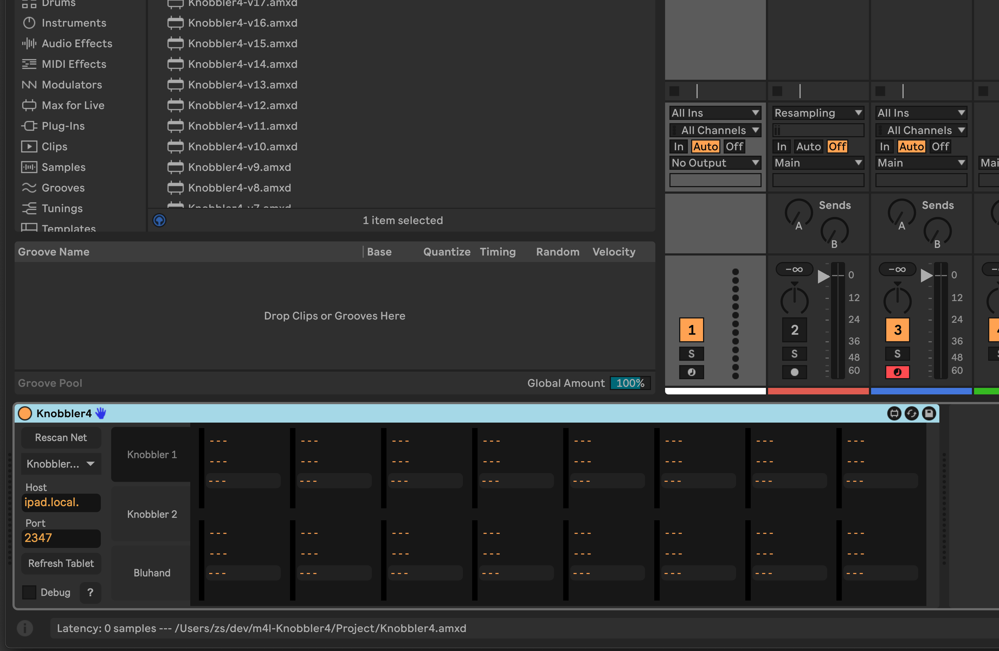
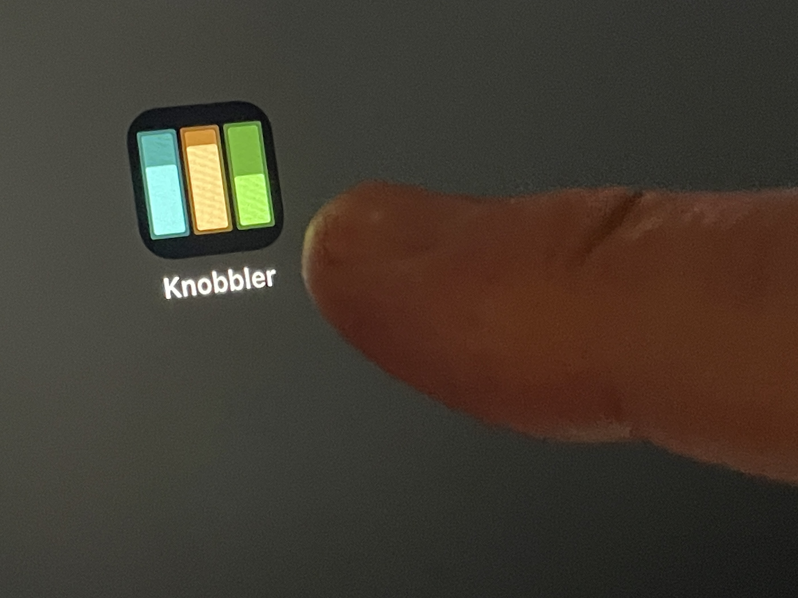
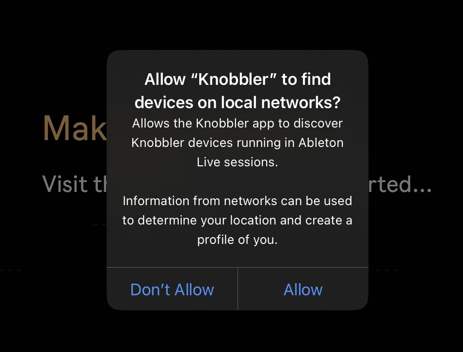
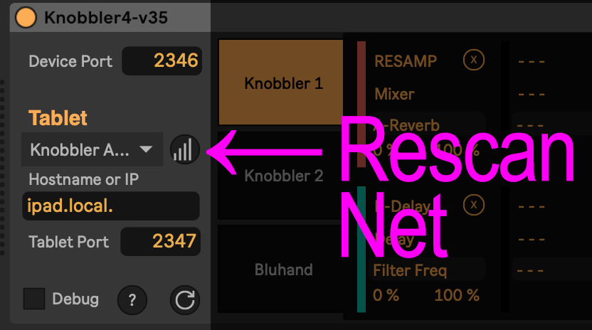
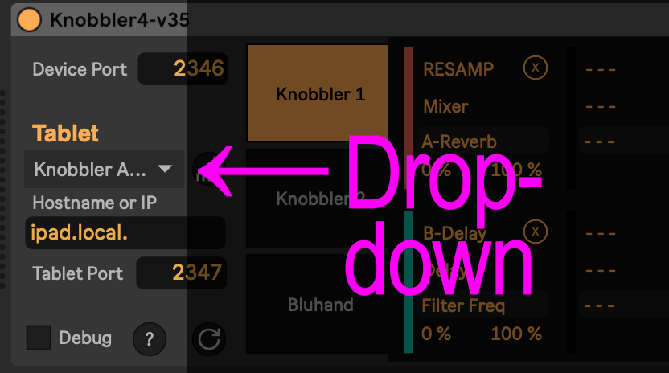
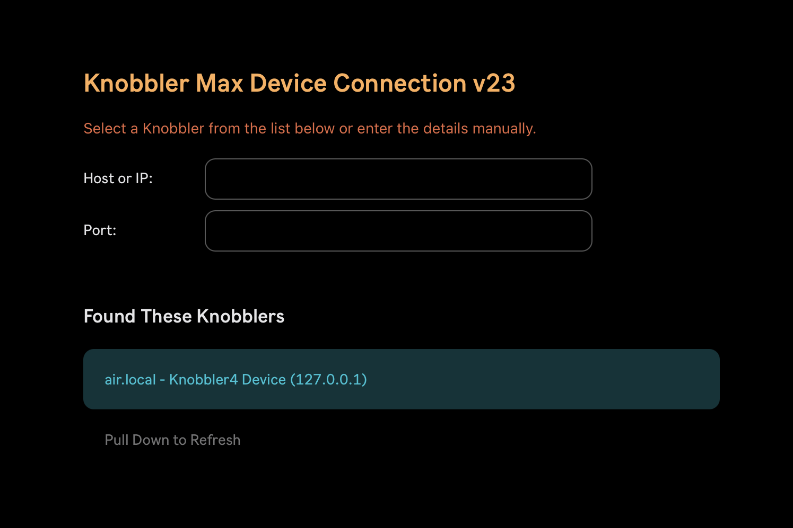

### Setup

- Download the latest version of the Knobbler device for Ableton Live (download button above).
- Get the [Knobbler app for your iPhone or iPad](https://apps.apple.com/us/app/knobbler/id6740183923) or [Android Device](https://play.google.com/store/apps/details?id=com.anonymous.knobblernative)
- Open Ableton Live
- Add the Knobbler device to a track, perhaps the Main or Master track.
  
- Open the Knobbler app on your iPhone, iPad, or Android device
  
  > - If it's the first time, make sure to allow Knobbler to find devices on your network. This is how it will find its companion device in your Ableton Live set.
  >   
- Click "Rescan Net" in the Knobbler device in Ableton Live.
  
- Choose your iPad from the drop-down list.
  
- Back on the iPad, select your computer from the list. "air.local" in the screenshot below.
  
  > - If you are seeing the "Nobody Home" message, pull down on the message to refresh. Your computer should show up after that.
  >   
- You should see a "Connection Success" message. From there, it's time to get to Knobblin'!
  

If you want to use more than one device, then follow these instructions here: [Multiple Devices](./multiple-tablets.md).

Next, check out all of Knobbler's [Features](./features.md).

If you're having trouble, then check out [Troubleshooting](./troubleshooting.md).

If you are somewhere without a WiFi network, here are some instructions to [create a private WiFi network on your Mac](wifi-adhoc.md).
