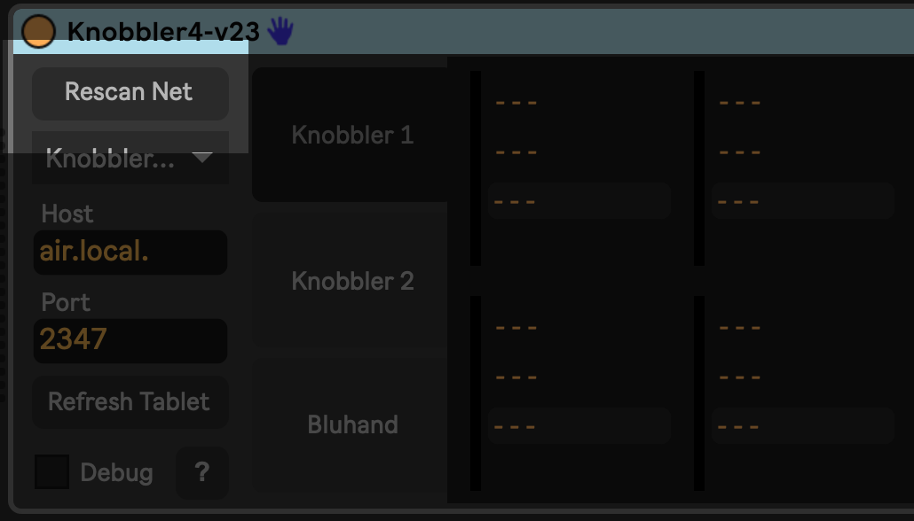
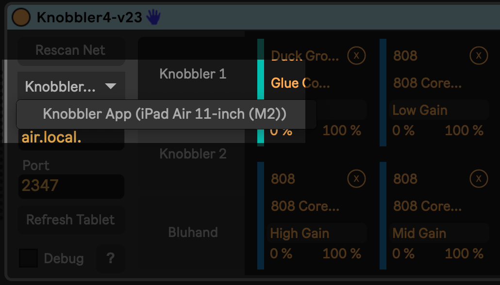

### Setup

- Open Ableton Live
- Add the Knobbler device to a MIDI track
  
  - (I like to dedicate a track to it and keep it out of the way)
- Open the Knobbler app on your iPad
  
- If it's the first time, make sure to allow Knobbler to find devices on your network. This is how it will find its companion device in your Ableton Live set.
    
- Click "Rescan Net" in the Knobbler device in Ableton Live.
  
- Choose your iPad from the drop-down list.
  
- Back on the iPad, select your computer from the list. "air.local" in the screenshot below.
  
  - If you are seeing the "Nobody Home" message, pull down on the message to refresh. Your computer should show up after that.
    
- You should see a "Connection Success" message. From there, it's time to get to Knobblin'!
  

> NOTE: Knobbler uses Ableton Live's "Blue Hand" functionality to power many of its features. Check to see if you have a blue hand icon in the title bar of the currently selected device like this:
> 

> If not, then you will need to choose a compatible [control surface](control-surfaces.md) from Live's MIDI settings page. You do not need to own the control surface, just selecting it in the MIDI settings page enables the Blue Hand functionality in Live. "ADVANCE" is a safe one to choose.

Next, check out all of Knobbler's [Features](./features.md).

If you're having trouble, then check out [Troubleshooting](./troubleshooting.md).

Perhaps you want to connect over [USB](./USB.md)?
