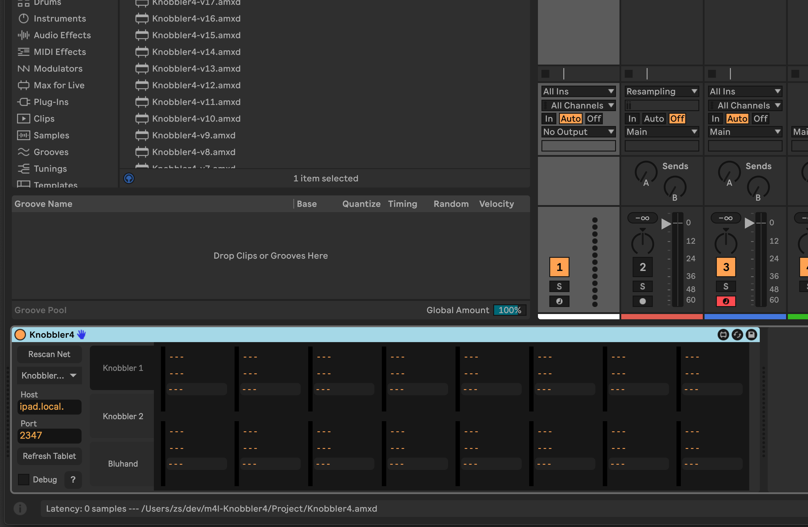
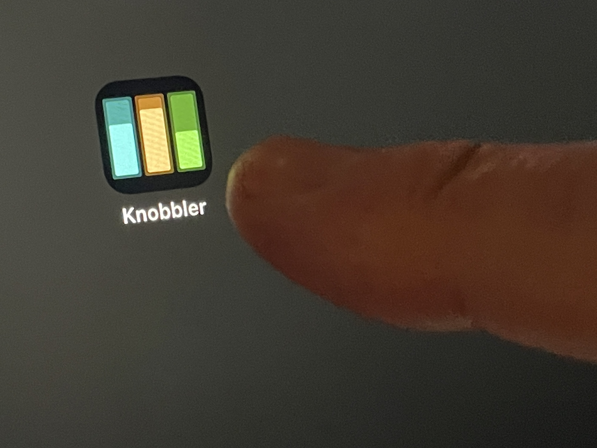
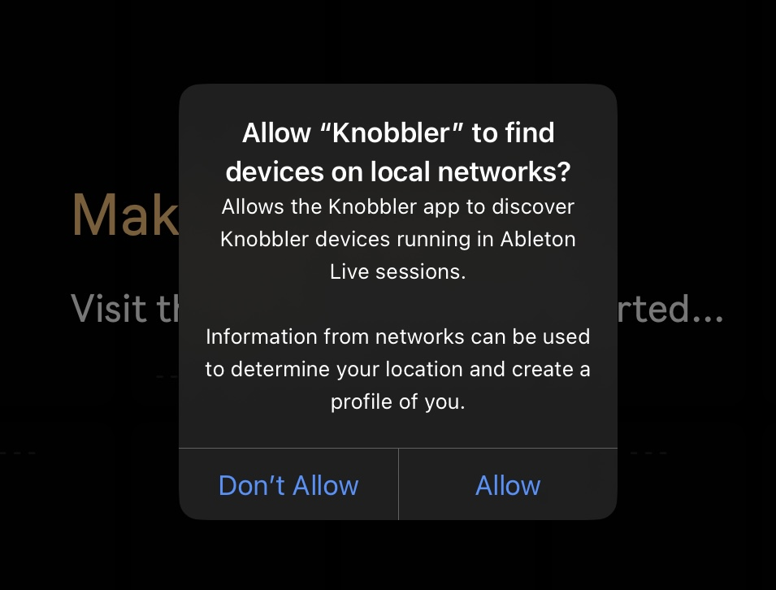
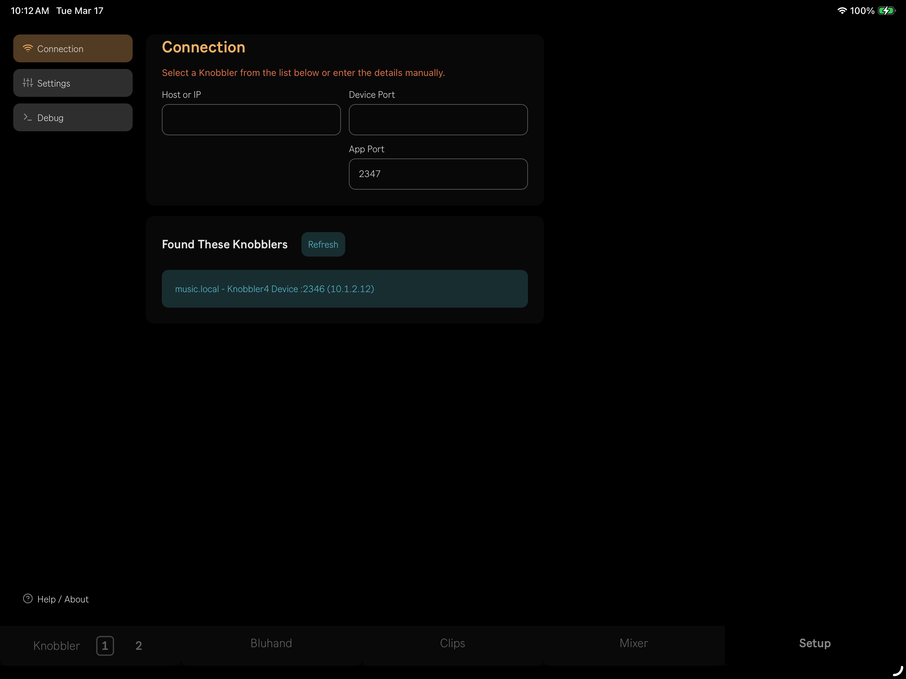
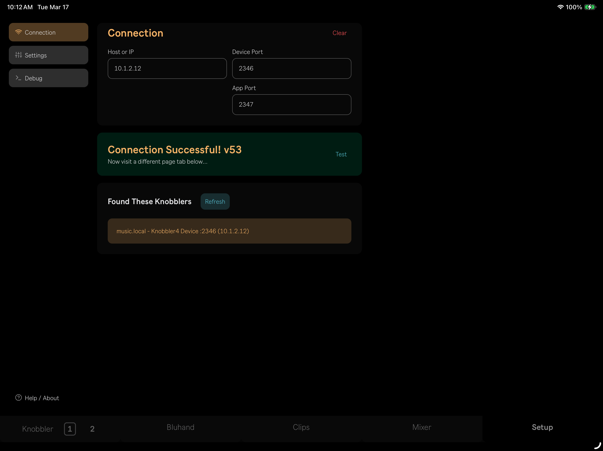

### Setup

- Download the latest version of the Knobbler device for Ableton Live (download button above).
- Get the [Knobbler app for your iPhone or iPad](https://apps.apple.com/us/app/knobbler/id6740183923) or [Android device](https://play.google.com/store/apps/details?id=com.anonymous.knobblernative).
- Open Ableton Live.
- Add the Knobbler device to a track, perhaps the Main or Master track.
  
- Open the Knobbler app on your phone or tablet.
  
  > If it's the first time, make sure to allow Knobbler to find devices on your network. This is how it will find its companion device in your Ableton Live set.
  >   
- Go to the Setup tab in the app. Under "Found These Knobblers", tap the entry for your computer. One tap is all it takes — the app sends its address to the device and both sides configure themselves automatically.
  
  > If you see the "Nobody Home" message, tap **Refresh** to rescan the network. Make sure both your computer and device are on the same WiFi network, and that Ableton Live has Local Network permissions enabled.
- You should see a "Connection Successful!" message. That's it — time to get Knobblin'!
  

#### Manual Setup

If one-touch connect is not working for your setup, you can configure the connection manually:

1. In the Knobbler device in Ableton Live, switch from "Auto Config" to manual mode.
2. Click "Rescan Net" and choose your device from the drop-down list, or enter the host/IP and port manually.
3. In the app's Setup tab, enter your computer's host/IP and device port, or select it from the discovered list.

If you want to use more than one device, then follow these instructions here: [Multiple Devices](./multiple-tablets.md).

Next, check out all of Knobbler's [Features](./features.md).

If you're having trouble, then check out [Troubleshooting](./troubleshooting.md).

If you are somewhere without a WiFi network, here are some instructions to [create a private WiFi network on your Mac](wifi-adhoc.md).
