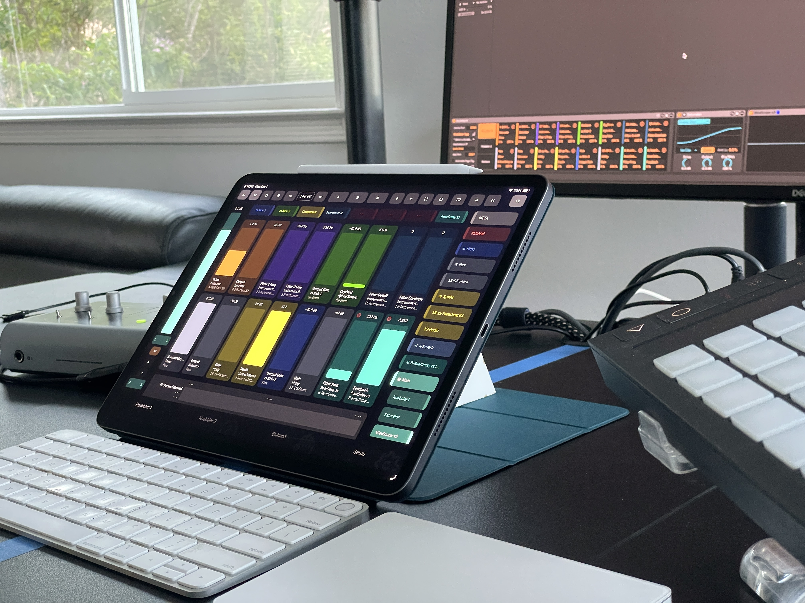
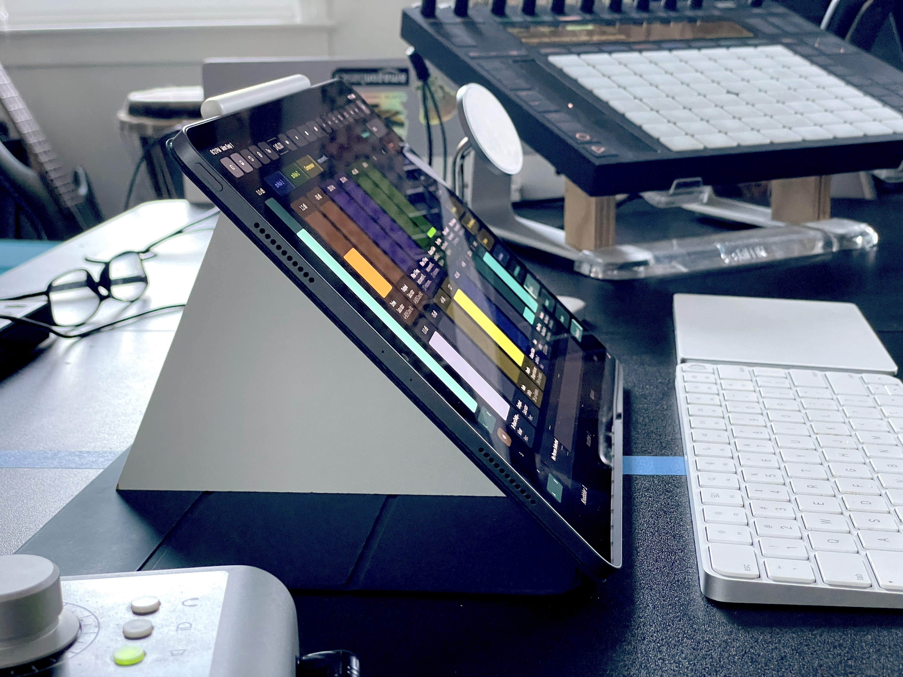
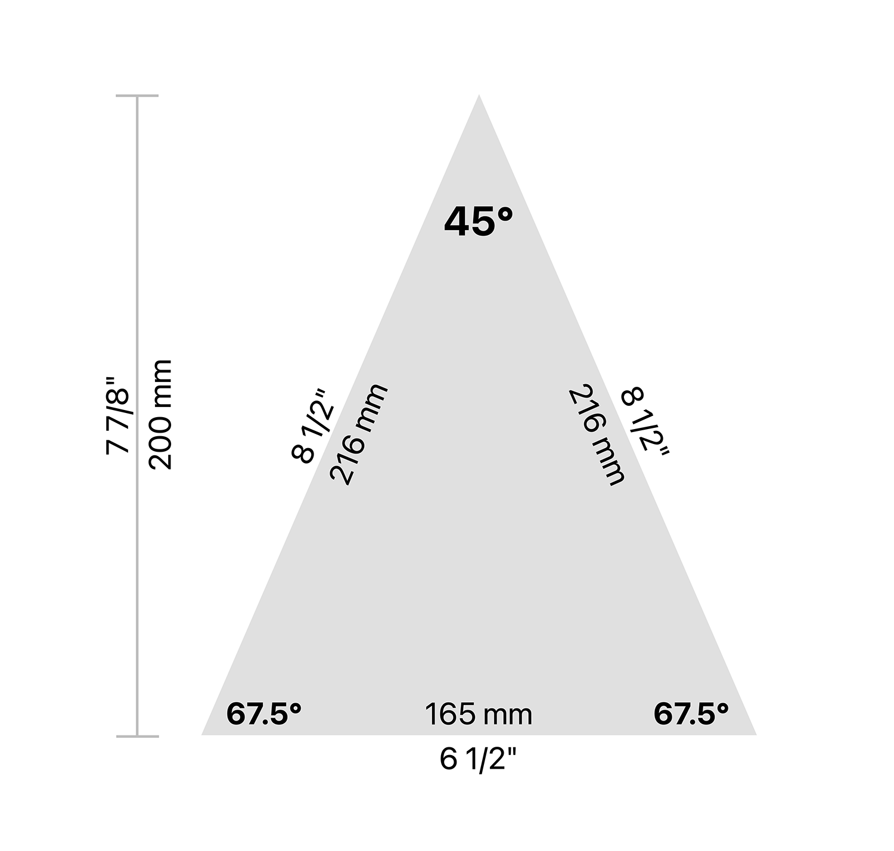
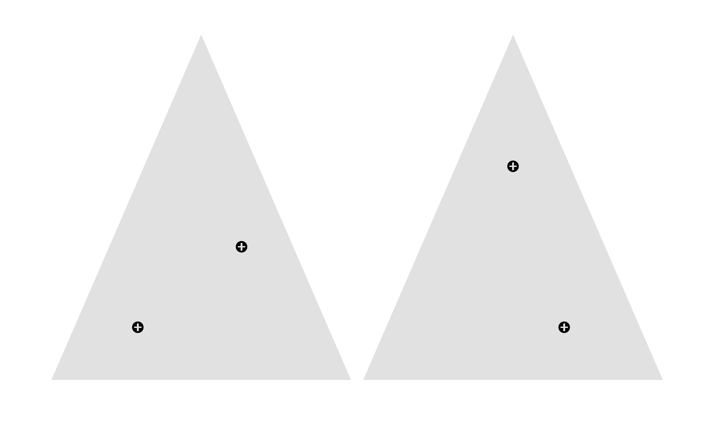

## Tablet Stand

Everyone is going to have a different way they prefer to keep their tablet when using Knobbler. I just wanted to share mine in case it plants some seeds for ideas in you, or if you just want to try something new.

I like to keep my iPad right in front of my keyboard, propped up at a 45 degree angle.

I'm using the Apple "Smart Folio" case. Mine is a suede material that has good friction with the desk.

The wedge is heavy enough to stay in place, and the case does a good job in preventing any pivoting movement.

The stand is made from four layers of MDF sourced from some old IKEA furniture. The layers are screwed together using countersunk drywall screws.

### Stand Plans

Overall Diagram

Screw Hole Templates

1. Cut four rectangles of wood, label them A, B, C, D.
2. Sketch the triangle on each piece of wood.
3. Indicate screw hole location on each piece of wood, alternating between the two patterns (A & C should be one, B & D should be the other).
4. Attach piece B to A using the screw holes indicated on B.
5. Attach piece C to B using the screw holes indicated on C.
6. Attach piece D to C using the screw holes indicated on D. Now you have a very thick rectangle of wood.
7. Cut the triangle on your table saw or chop / miter / hand saw.
8. ...
9. Profit!

What's your stand of choice? Let me know. [zack@steinkamp.us](mailto:zack@steinkamp.us)
