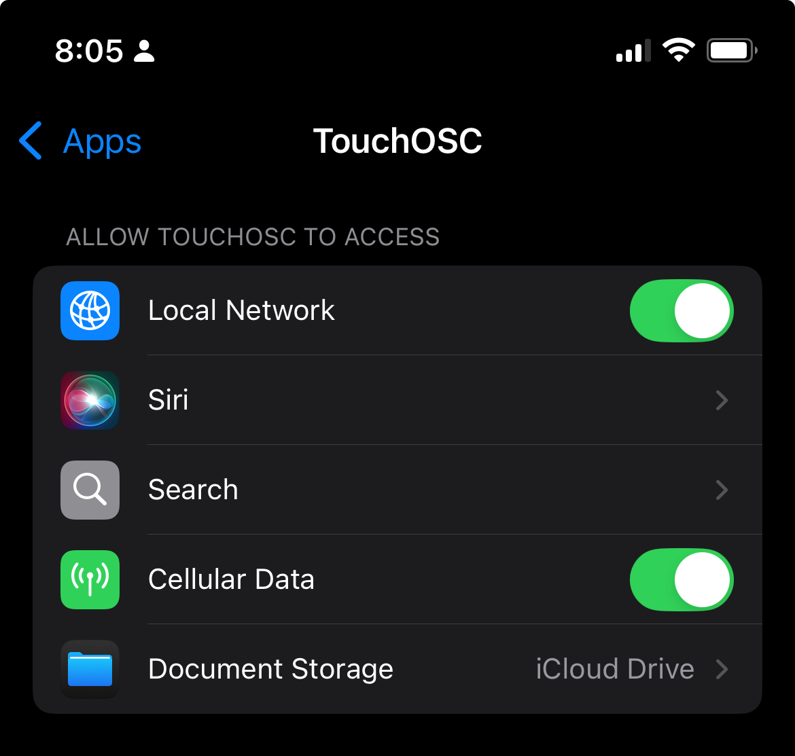
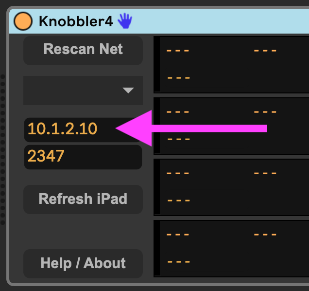
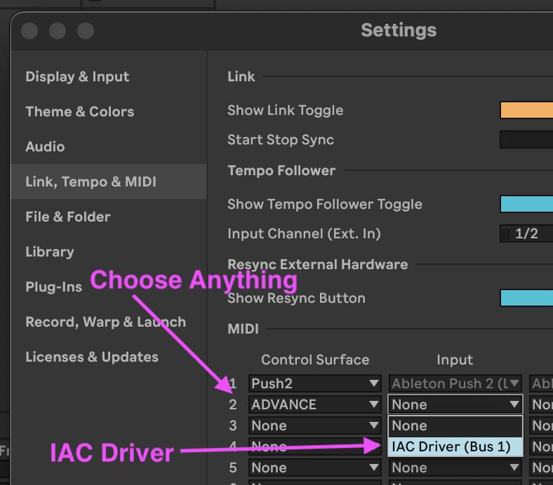
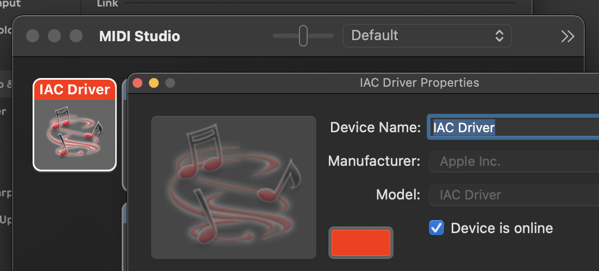

## Troubleshooting

#### PROBLEM: I see a warning about control surfaces in the Knobbler device in Ableton Live. Halp!

Knobbler relies on some functionality of Ableton Live that it only enables when there is a Control Surface configured. To remedy the situation:

* Open Live's settings
* Click "Link, Tempo and MIDI"
* Under the Control Surface column, choose "ADVANCE".
* Close the settings window
* The warning should disappear

Note that many other choices in the Control Surfaces menu also work, but not all of them. The full list of working control surfaces can be found [here](https://raw.githubusercontent.com/zsteinkamp/m4l-Knobbler4/refs/heads/main/control_surfaces.txt). Look for the ones with a "*" next to them.

#### PROBLEM: I see a warning in the Knobbler iPad app about a compatible version of the device. Haaalp!

The Knobbler app and device are constantly being improved. By virtue of being an iPad app, the Knobbler app is likely set to auto-update. It is likely that a future version of the Knobbler iPad app requires functionality provided by a future version of the Knobbler device. 

When the Knobbler device first communicates with the iPad, it sends a version number. The iPad app has a minimum device version coded into it, and it will prompt you if it is communicating with a device that is too old.

Simply download the latest version of the device and install it as you normally would, by dragging it to the User Library in Ableton Live.

You can use the "Swap Device" function in Ableton live to switch from an older version to a newer version, with all of your mapping preserved.

#### PROBLEM: I am unable to successfully browse my network for my computer / tablet.

This generally indicates either a problem with application permissions (more common) or WiFi network setup (less common).

On the Mac, ensure `Ableton Live` is given permission to browse the local network to discover devices. This is done in `System Settings` .. `Privacy & Security` .. `Local Network`. Ensure `Ableton Live` is enabled in your list.

On iOS, go to `Settings` .. `Apps` .. `Knobbler`, and ensure its `Local Network` switch is enabled.

You may need to restart the apps or machines on the various sides of the connection for the changes to actually take effect.

If both sides have Local Network discovery enabled, then it's possible that the WiFi or other network equipment has this kind of discovery blocked.

Check in your network equipment's configuration interfaces around the terms "Bonjour", "Zeroconf", "uPnP", "mDNS", "Multicast DNS", or "Service Auto-Discovery". Some routers have options to disable this traffic, and many people don't know what it is and disable it.

#### PROBLEM: I can move sliders on the tablet screen and see parameters in Ableton Live update, but no labels, colors, or values are shown on the tablet.

This indicates there is a problem with network data going from the computer to the tablet.

First, try clicking `Rescan Network` and choosing your tablet from the dropdown. If this fixes the problem, then it points to a prior incorrect value in the Hostname or Port fields that is now fixed.

If that does not work, then check to see if any other apps may be running on the tablet that could interfere with Knobbler receiving data. Most likely this would be the app Protokol (mentioned below) used to debug the connection. If it is left running, it will eat all the network messages destined for TouchOSC. You will need to restart Knobbler after closing Protokol.

If the port is correct, then the last thing to try is to use the iPad's IP address instead of its hostname in the Knobbler device configuration. To see the iPad's IP address, go to the WiFi settings and click the information icon next to your WiFi network.

Use that IP address in the Host field in the Knobbler device instead of the tablet hostname.

Then click "Refresh iPad" to see if that fixes it.

If you've tried all that, please send screen shots or screen recordings to zack@steinkamp.us :)

#### PROBLEM: Things are updating on the tablet, but moving the sliders on the tablet does not change or map any any parameters.

This indicates a problem in network communication from the tablet to Ableton Live.

First, ensure that there are not any programs open on the computer that may be "eating" the OSC messages from the tablet. Most commonly, these are Max and Protokol.

If you open Knobbler in Max to edit, you must completely quit out of Max in order for OSC / UDP to work properly. This is because Max holds on to the listening socket for the OSC messages even if you have closed the Knobbler device window.

You may also use Protokol to troubleshoot OSC issues, and if that is left open then it will keep eating those OSC packets.

If no other applications are open, then ensure the connection settings in Knobbler on the tablet exactly follow the instructions in the the [Setup Instructions](setup.md), including browsing for the computer hostname and port with Knobbler open in your Live Set.

You may need to use the IP address of your computer rather than browsing for it. You can get that from your computer's network settings. Make sure to get the address of the interface that you are actually using to connect to the tablet, e.g. wired Ethernet or WiFi.

You can use the app Protokol on your tablet (from the same people who make TouchOSC) to observe OSC messages. You will need to close Knobbler before opening Protokol, and vice-versa for things to work properly.

#### PROBLEM: I do not have a Blue Hand icon showing up in the currently selected device's title bar.

If you do not see the Blue Hand, then you will need to set up a "dummy" control surface in order for the Bluhand portion of Knobbler to work. To do this, you can open the settings in Live and switch to the Link, Tempo & MIDI tab. Chooose any supported control surface from the list ("ADVANCE" is a good choice) and assign its input to the IAC driver. The full list of tested control surfaces is available in [control-surfaces.md](control-surfaces.md).

If you do not have the IAC driver set up, then open the Audio & Midi Setup app, open the MIDI window, double click the IAC driver and make sure it is Online.

#### PROBLEM: HALP! Nothing above covers what I'm experiencing!

Send me any info you can cobble together with a clear description of the problem and steps that got you there, things you tried, other things in your environment or configuration that might be relevant, events from your childhood that relate, etc. zack@steinkamp.us
