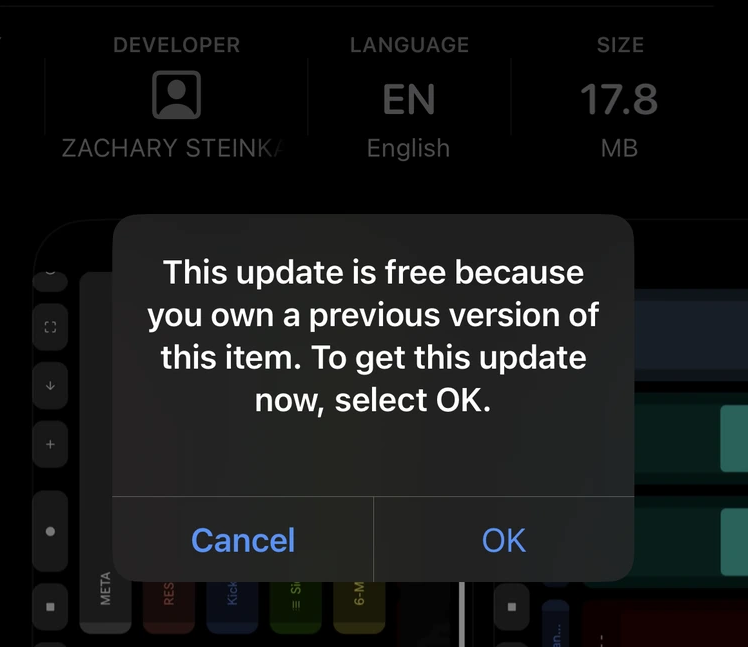
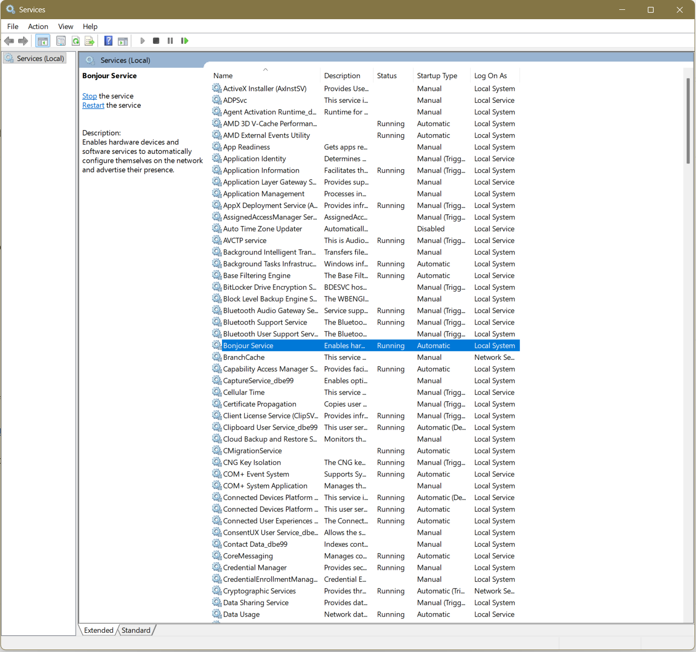
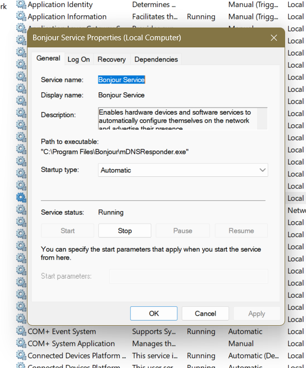
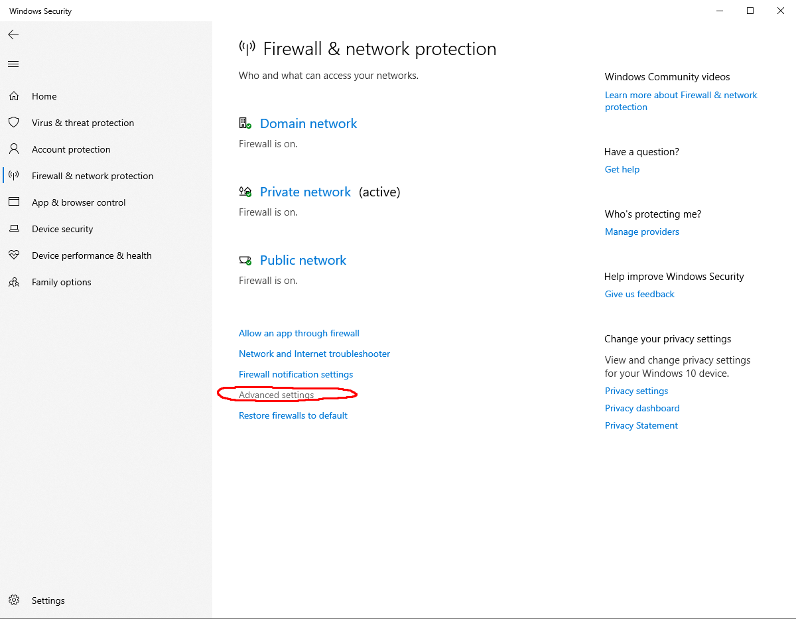
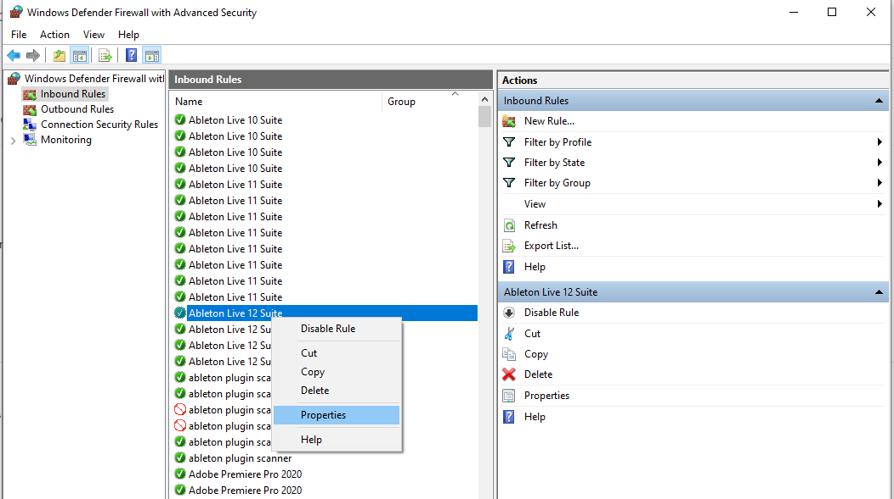
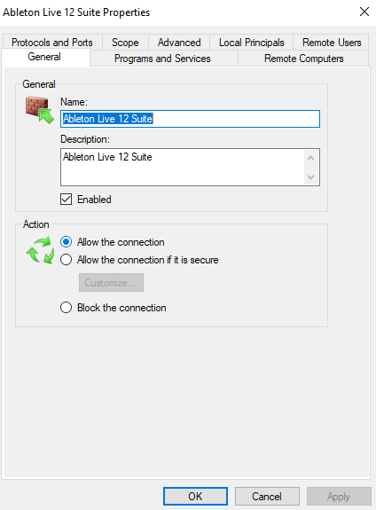
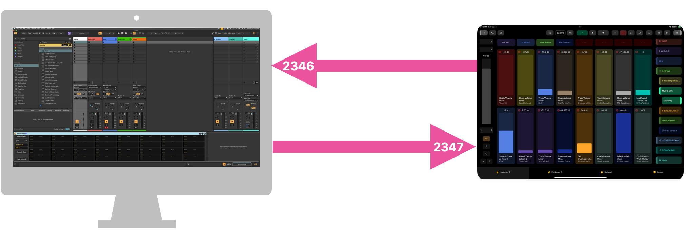

## Troubleshooting

#### I have already purchased Knobbler for iPad and when I go to install it on my phone, it seems I have to pay again. What's up?

You will not have to pay twice. Just make sure you are logged in to the App Store on both devices with the same ID.

This seems to be a bug/problem in the Apple App Store for apps that started out as iPad-only and then opened up to iPhones as well. Just continue through the purchase process. After double-tapping the side button, you will see this popup:

After tapping "OK" you will be returned to the product page with the app installed. You will not be charged.

#### I see a warning in the Knobbler iPad app about a compatible version of the device. Haaalp!

Simply download the latest version of the device and install it as you normally would, by dragging it to the User Library in Ableton Live.

You can use the "Swap Device" function in Ableton live to switch from an older version to a newer version, with all of your mapping preserved.

Swap to the newer version and save your Live Set.

The Knobbler app and device are constantly being improved. By virtue of being an iPad app, the Knobbler app is likely set to auto-update. It is possible that a future version of the Knobbler iPad app requires functionality provided by a future version of the Knobbler Ableton Live device.

When the Knobbler device first communicates with the iPad, it sends a version number. The iPad app has a minimum device version coded into it, and it will prompt you if it is communicating with a device that is too old.

#### I am a Windows user and am not able to discover the app on my phone/tablet from the Knobbler4 device, and see the "Nobody Home :(" error on the Knobbler app.

The Bonjour service required to be running on Windows in order for the network discovery functionality to work.

To ensure that Bonjour Service is running:

* Windows key and type 'services' + Enter to open the services list
* Find Bonjour Service

* If the service is already running, stop here
* If not running
   * right click and select Start from the menu
   * once started, right click again and select Properties
   * in the properties pane, click on the Startup type and select Automatic to ensure the service starts on reboot

> Thank you Dave Horsey ([RFK-23 on Soundcloud](https://soundcloud.com/user-106233343)) for the information and screenshots!

If Bonjour is running, ensure that the Windows Firewall is configured to allow traffic to and from Ableton Live and that the Knobbler app on your device has Local Network permissions. On iOS (iPhone, iPad) that can be found in Settings > Privacy & Security > Local Network and make sure that Knobbler is enabled.

#### I am going to be somewhere without WiFi. What can I do?

The simplest and most reliable option is to get a cheap WiFi access point and bring it with you. [Here is one for $30 on Amazon.](https://www.amazon.com/TP-Link-AC1200-Router-Archer-A54/dp/B09G5Y1HWZ)

If you have a Mac, check out the [instructions to set up an ad-hoc WiFi network](wifi-adhoc.md) on your computer that your iPad can join.

If you are on Windows, [these instructions](https://support.structure.io/article/354-how-to-create-an-ad-hoc-connection-with-windows) may help.

#### I am unable to successfully browse my network for my computer / tablet.

This generally indicates either a problem with application permissions (more common) or WiFi network setup (less common).

On the Mac, ensure `Ableton Live` is given permission to browse the local network to discover devices. This is done in `System Settings` .. `Privacy & Security` .. `Local Network`. Ensure `Ableton Live` is enabled in your list.

On iOS, go to `Settings` .. `Apps` .. `Knobbler`, and ensure its `Local Network` switch is enabled.

On Windows, the settings look like this:

You may need to restart the apps or machines on the various sides of the connection for the changes to actually take effect.

If both sides have Local Network discovery enabled, then it's possible that the WiFi or other network equipment has this kind of discovery blocked.

Check in your network equipment's configuration interfaces around the terms "Bonjour", "Zeroconf", "uPnP", "mDNS", "Multicast DNS", or "Service Auto-Discovery". Some routers have options to disable this traffic, and many people don't know what it is and disable it.

#### I can move sliders on the tablet screen and see parameters in Ableton Live update, but no labels, colors, or values are shown on the tablet.

This indicates there is a problem with the computer-to-tablet network connection.

First, try clicking `Rescan Network` and choosing your tablet from the dropdown. If this fixes the problem, then it points to a prior incorrect value in the Hostname or Port fields that is now fixed.

Next, ensure that Knobbler has "Local Network" permissions. Go to Settings ... Privacy & Security ... Local Network and ensure that Knobbler is enabled.

If that does not work, then check to see if any other apps may be running on the tablet that could interfere with Knobbler receiving data. Most likely this would be the app [Protokol](https://hexler.net/protokol) (mentioned below) used to debug the connection. If it is left running, it will eat all the network messages destined for TouchOSC. You will need to restart Knobbler after closing Protokol.

If the port is correct, then the last thing to try is to use the iPad's IP address instead of its hostname in the Knobbler device configuration. To see the iPad's IP address, go to the WiFi settings and click the information icon next to your WiFi network.

Use that IP address in the Host field in the Knobbler device instead of the tablet hostname.

Then click "Refresh iPad" to see if that fixes it.

If you've tried all that, please send screen shots or screen recordings to zack@steinkamp.us :)

#### Things are updating on the tablet, but moving the sliders on the tablet does not change or map any any parameters.

This indicates a problem in network communication from the tablet to Ableton Live.

First, ensure that there are not any programs open on the computer that may be "eating" the OSC messages from the tablet. Most commonly, these are Max and Protokol.

If you open Knobbler in Max to edit, you must completely quit out of Max in order for OSC / UDP to work properly. This is because Max holds on to the listening socket for the OSC messages even if you have closed the Knobbler device window.

You may also use [Protokol](https://hexler.net/protokol) to troubleshoot OSC issues, and if that is left open then it will keep eating those OSC packets.

If no other applications are open, then ensure the connection settings in Knobbler on the tablet exactly follow the instructions in the the [Setup Instructions](setup.md), including browsing for the computer hostname and port with Knobbler open in your Live Set.

Furthermore, ensure that the Firewall settings for your computer or network are not preventing network access to Ableton Live. Both Mac and Windows require an exception be added to the Firewall configuration if it is enabled. Also ensure that on MacOS that Ableton Live has "Local Network" permissions in System Settings ... Privacy & Security ... Local Network.

You may need to use the IP address of your computer rather than browsing for it. You can get that from your computer's network settings. Make sure to get the address of the interface that you are actually using to connect to the tablet, e.g. wired Ethernet or WiFi.

#### When I navigate into rack chains, the chains and devices stay hidden in Live.

If you want to have the Live UI follow what you are seeing in Knobbler's navigation panel, you will need to configure a Control Surface in Live'a MIDI settings. Choose the "ADVANCE" control surface from the dropdown, and nested devices will be displayed as you navigate.

#### I cannot get more than one tablet/instance to work properly.

Starting with v36, Knobbler may be used with multiple devices. You must add as many instance of Knobbler as you have devices you want to use with it. Ensure the "Device Port" setting is unique across all instances.

#### The ports in the device and in the app are different. What gives?

This is by design.

The Knobbler Max for Live device listens on UDP port 2346. The Knobbler app on your tablet listens on UDP port 2347. On a phone, the listen port is 2349. This is intentional, since while developing Knobbler I will run all on one computer (the apps in simulators), and you cannot have two things using the same port.

#### Some devices show up in the Navigation with the title "? Unsupported". What gives?

Ableton seems to have "forgotten" about some old devices like CC Control. These devices do not adhere to Ableton's device API standard, and thus cannot provide Knobbler with information about themselves that it needs to operate, such as the title of the device or parent track.

I have filed a support ticket with Ableton about this, and for now unfortunately things do not work properly in Knobbler with those devices. Their parameters will show up on the Bluhand page, but mapping to Knobbler page sliders does not work properly, and the device title on the Bluhand page does not update.

#### HALP! Nothing above covers what I'm experiencing!

Send me any info you can cobble together with a clear description of the problem and steps that got you there, things you tried, other things in your environment or configuration that might be relevant, screenshots (there are never too many screenshots), events from your childhood that relate, etc. zack@steinkamp.us
