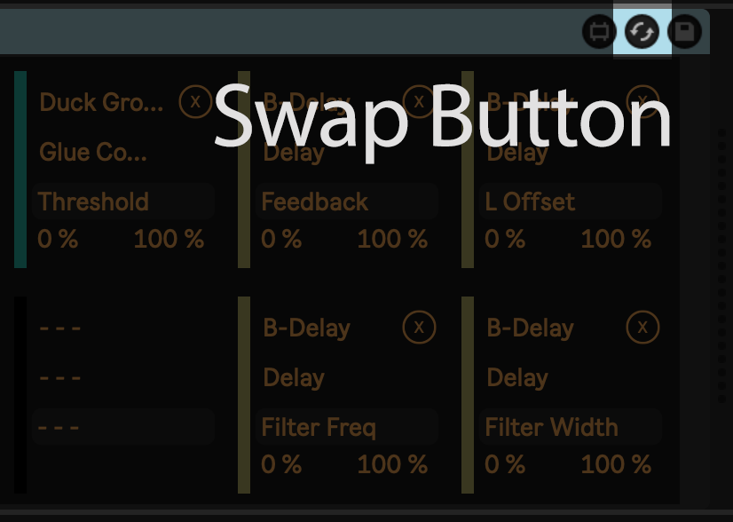
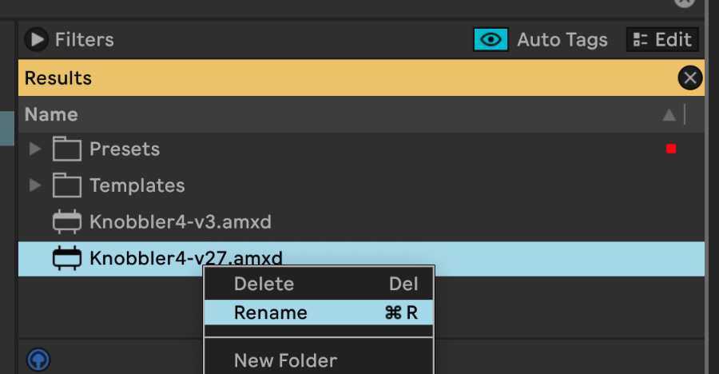
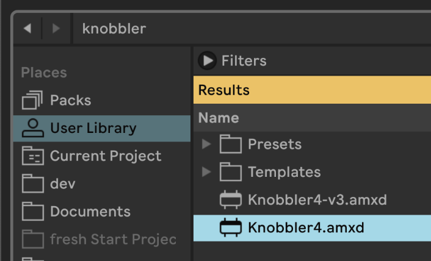

## Updating the Max Device

Updates to the Knobbler iPad / Android app sometimes necessitate an update to the Knobbler Max for Live device.

The minimum Max for Live device version is coded into each Knobbler app release, and is only changed with truly necessary, since updating the device does not happen automatically.

It is very easy to update the device in your existing Live Sets, and this document shows a couple of strategies for managing it.

### Method 1: Use the "Hot-Swap" function of Live

Simply download the latest Knobbler release (buttons on the top and bottom of this page) and then drag the downloaded file to your User Library in Live.

Each device you add to your set has a Hot-Swap button in the toolbar. This allows you to swap the device for another. In the case of Knobbler, this lets you update to a newer version of your device *without losing your mappings*.

Click the Hot-Swap button then locate and double-click the newest Knobbler you added to your User Library.

This will swap out the older Knobbler device for the newer one.

Save your Live Set and you are good to go!

### Method 2: Copy the versioned file to an unversioned file

This one is a little more involved at download time, but will let you open old sets without having to change anything.

After downloading the latest Knobbler and adding it to your User Library, rename it to "Knobbler4.amxd". Then use this unversioned file to use with your Live Sets.

If you always do this when updating Knobbler, then opening Live Sets will "just work" to use the latest version of the Knobbler device.

If you have questions, you can always [email me](mailto:zack@steinkamp.us).
