# Connecting Without WiFi (USB or Ad-Hoc)

Sometimes you can't (or don't want to) put your Mac and tablet on the same WiFi
network — you're at a venue, a practice space, or you simply want the rock-solid
reliability of a cable. Knobbler works in these situations too.

There are three approaches, in rough order of convenience:

- A **[phone hotspot](#phone-hotspot)** — tether both the Mac and the tablet to
  your phone's Personal Hotspot. Zero config, auto-discovery still works, and it
  travels anywhere.
- A **direct [USB connection](#usb-connection-recommended)** between an iPad/iPhone
  and a Mac — rock-solid and wired, but you fill in two IP addresses by hand.
- An **[ad-hoc WiFi network](#ad-hoc-wifi-network)** created on the Mac — wireless
  with no router, but the most setup.

## Phone Hotspot

If you have a phone with you, the simplest no-router option is to tether **both**
your Mac and your tablet to the phone's **Personal Hotspot**. The hotspot puts both
devices on the same private network and routes traffic between them — including the
multicast discovery messages Knobbler uses — so this behaves just like a normal
WiFi network. **Auto-discovery works, and there are no IP addresses to type in.**

1. Turn on **Personal Hotspot** on your phone (on iPhone: **Settings → Personal
   Hotspot → Allow Others to Join**).

2. Join that hotspot from **both** the Mac (WiFi menu → your phone's name) and the
   tablet (**Settings → WiFi → your phone's name**).

3. Add Knobbler to your Live Set, open the Knobbler app on the tablet, and go to
   the **Setup** page. It scans for and finds the device on the Mac automatically —
   select your Mac under **"Found These Knobblers"** and you're connected.

> **Tip:** this works without any cellular data plan or signal — the phone is just
> acting as a local router between your two devices, so nothing actually needs to
> reach the Internet. It's a great fallback at venues with no usable WiFi.

> **If discovery comes up empty:** a few phone-hotspot configurations isolate the
> connected devices from each other, so the Mac and tablet can't see one another
> even though both are online. If the scan finds nothing, just fall back to the
> [manual-IP method](#usb-connection-recommended) — read each device's hotspot IP
> and type them in by hand, exactly like the USB setup below.

## USB Connection (recommended)

With modern iOS and macOS, simply connecting an iPad or iPhone to a Mac with a USB
cable creates a private `169.254.x.x` ("link-local") network between the two
devices automatically — no Internet Sharing setup required.

Because the auto-discovery features of Knobbler don't operate over this link-local
network, you'll fill in the two IP addresses manually. It's a one-time setup.

1. Connect the iPad or iPhone to the Mac with a USB cable.

   > **Note:** after plugging in the cable, it can take up to 30 seconds for the
   > computer to negotiate the link-local network and assign the IP addresses. If
   > the addresses below don't appear right away, wait a moment and check again.

2. **Find the tablet's address.** Open the Knobbler app and go to
   **Setup → Connection**. The app displays its own `169.254.x.x` address at the
   top of the panel, labeled **"This device:"**.
   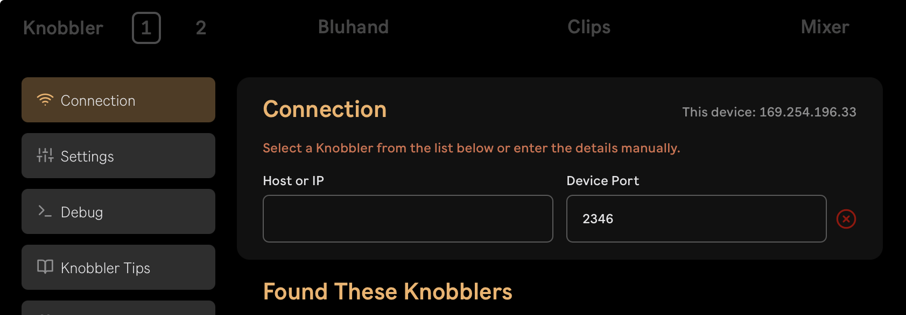

3. **Point the Live device at the tablet.** In the Knobbler4 device in Ableton
   Live, type the tablet's address (from step 2) into the **Hostname or IP** box,
   and set **App Port** to **2347**. (Leave the device's own **Device Port** at
   **2346**.)
   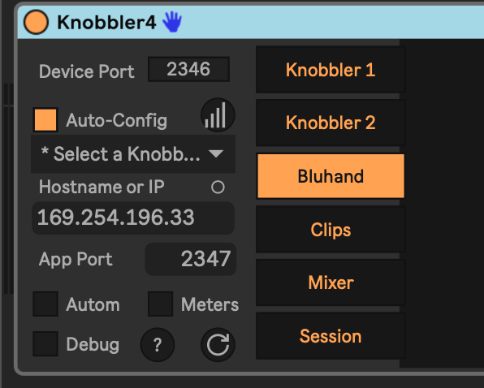

4. **Find the Mac's address.** Open Terminal on the Mac and run:

   ```
   ifconfig -a | grep 169.254
   ```

   Note the `169.254.x.x` address it prints (the value after `inet`).
   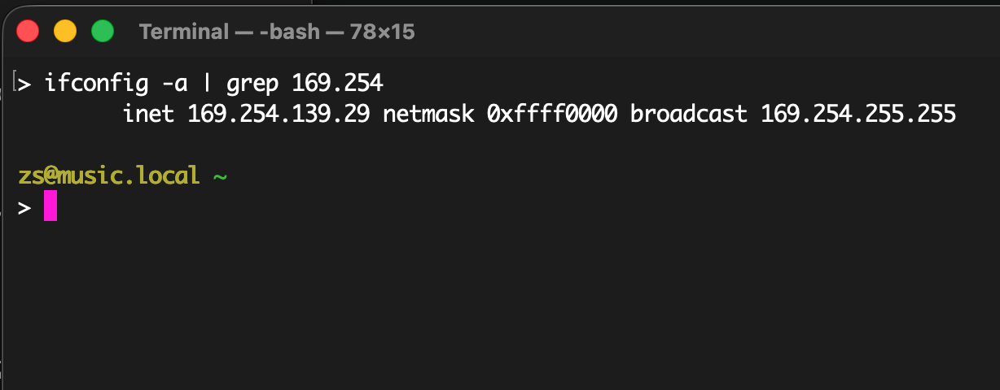

5. **Point the app at the Mac.** In the Knobbler app, type the Mac's address (from
   step 4) into the **Host or IP** box. Leave the device port at its default,
   **2346**.

6. Press **Test** in the app to exercise the connection. A green **Connected**
   banner confirms the link is working.
   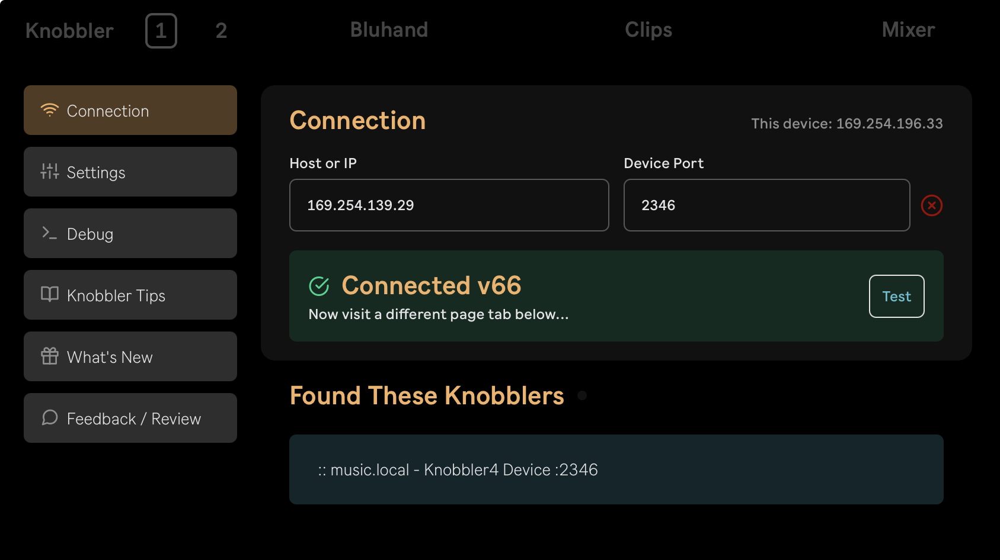

At this point Knobbler should be fully functional over the USB cable.

> **Tip:** the two ports are not the same on purpose — the Live device sends to the
> tablet on **2347**, and the tablet sends to the device on **2346** (the default).
> If Test fails, double-check that you didn't swap the two addresses or ports.

## Ad-Hoc WiFi Network

If you'd rather connect wirelessly but there's no WiFi network to join, you can
create an ad-hoc WiFi network on your Mac that your iPad can join.

These instructions are Mac-specific. If you have a Windows machine and can
contribute instructions, please [let me know](mailto:zack@steinkamp.us).

> (originally from [this post on Mac StackExchange](https://apple.stackexchange.com/questions/464557/how-to-create-computer-to-computer-network-on-macos-sonoma-2023).)

1. Run the following commands, one-by-one in Terminal:

   ```
   sudo networksetup -createnetworkservice AdHoc lo0
   sudo networksetup -setmanual AdHoc 192.168.1.88 255.255.255.255
   sudo networksetup -setmanual AdHoc 127.0.0.1 255.255.255.255
   ```

2. Configure sharing settings:

   - Open System Settings
   - Navigate to Sharing
   - Select Internet Sharing (i)
   - Set "Share connection from" to "AdHoc"
   - Set "To devices using" to "Wifi"
     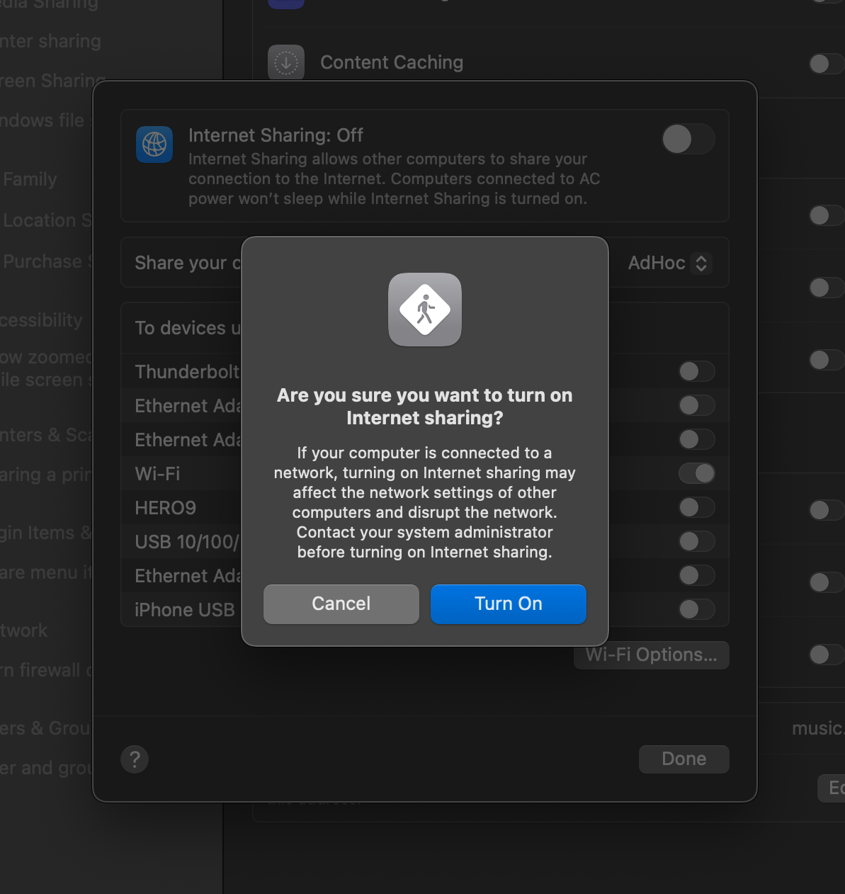
   - Configure the new WiFi network with a name, channel, and password
     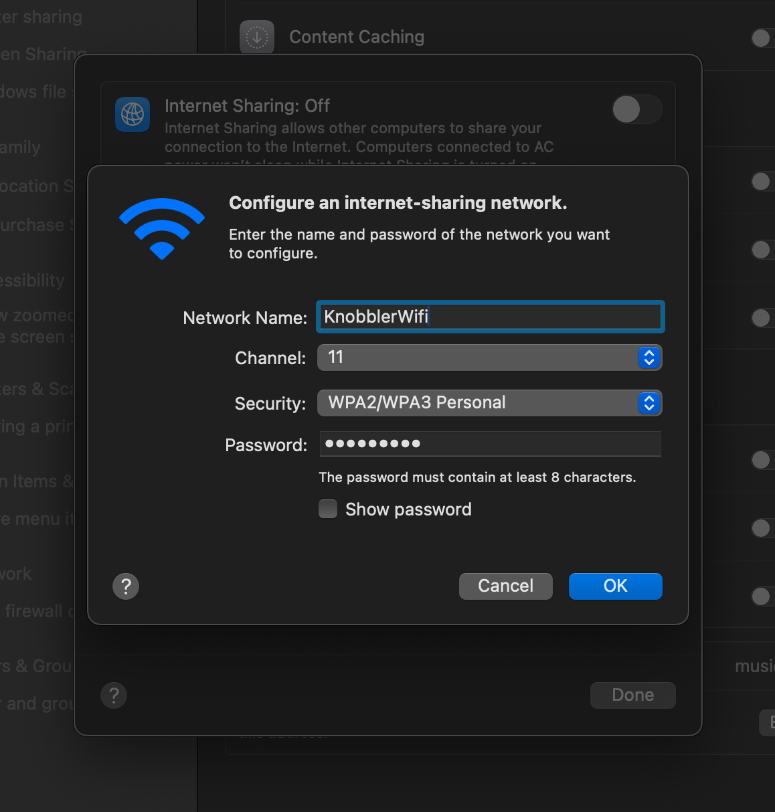
   - Ensure Internet Sharing is switched On
     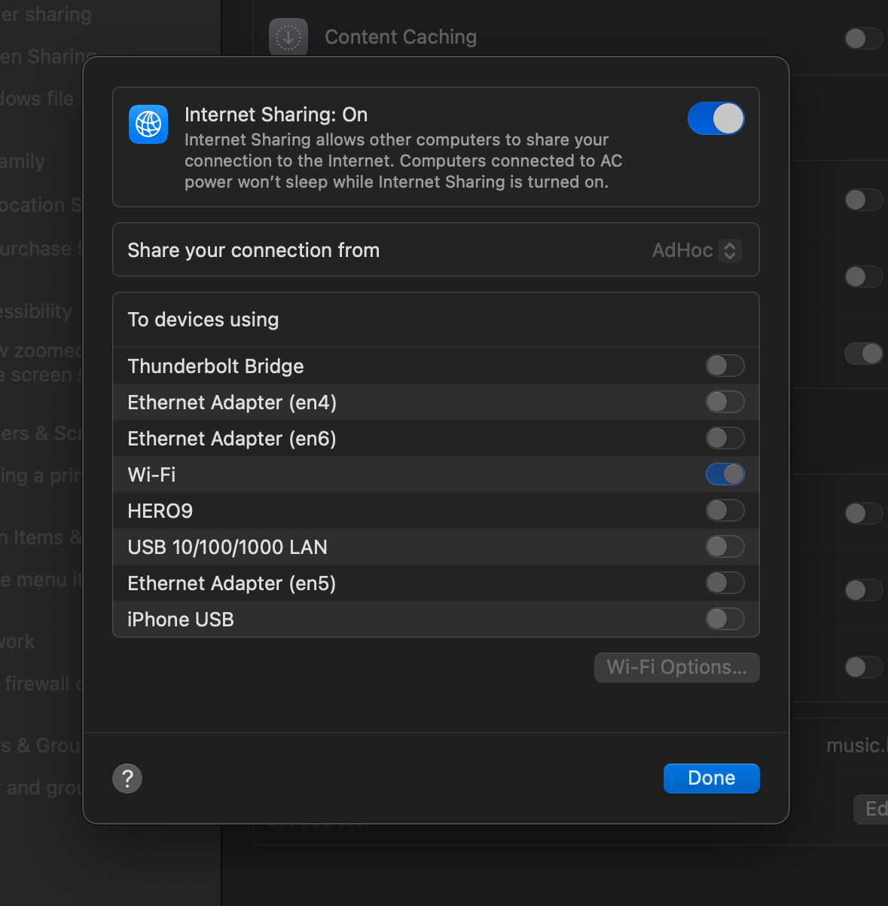

3. Join the WiFi network you just created on your iPad
   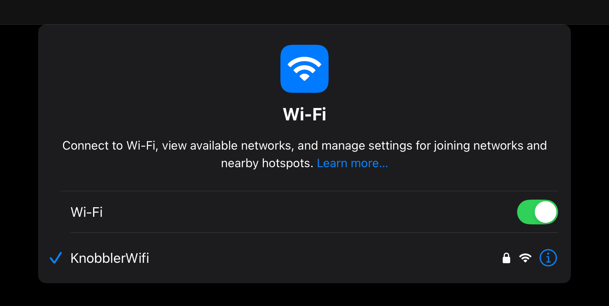

4. Tap the (i) icon next to the WiFi connection on your iPad and note the iPad's IP address. In the screenshot below, it is `192.168.2.4`
   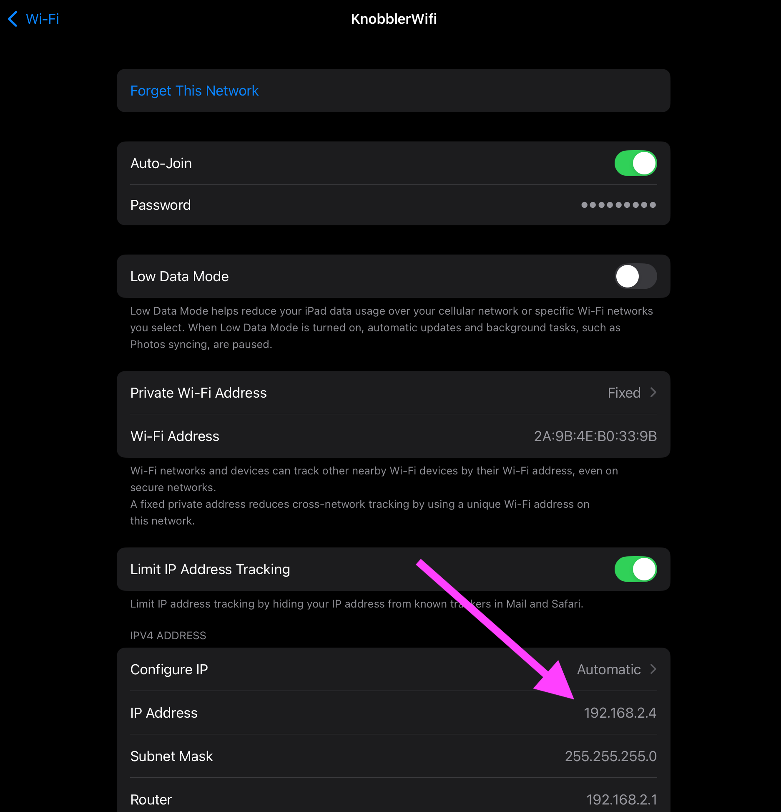

5. Add Knobbler to your Live Set and manually fill in the iPad's IP address.
   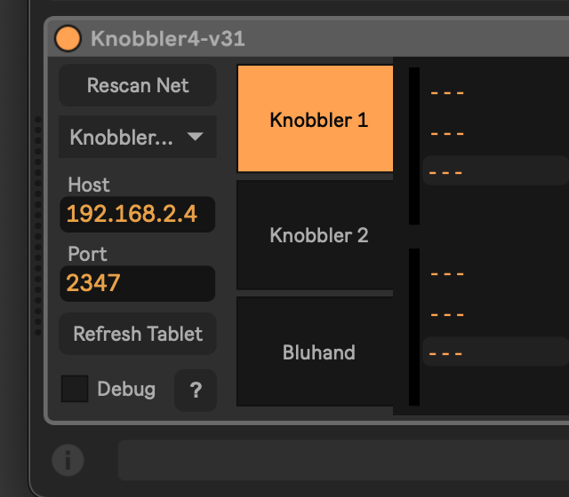

6. Open the Knobbler app on the iPad and go to the Setup page. It should scan for and detect the device on the Mac.
   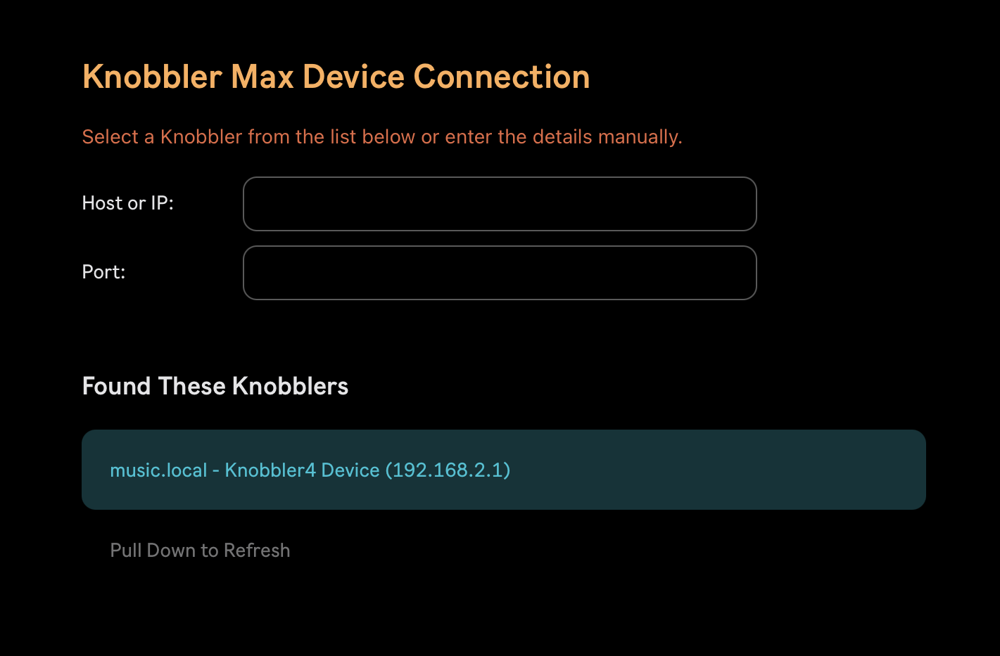

7. Select your Mac in the "Found These Knobblers" section. You should get a "Connection Successful!" message.
   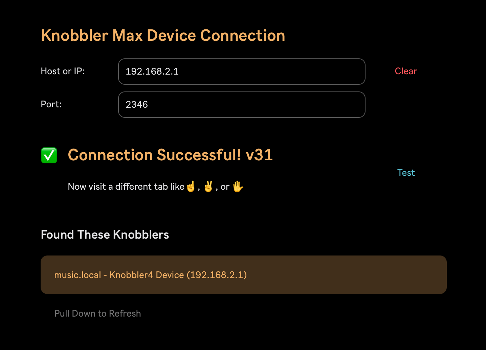
</content>
</invoke>
