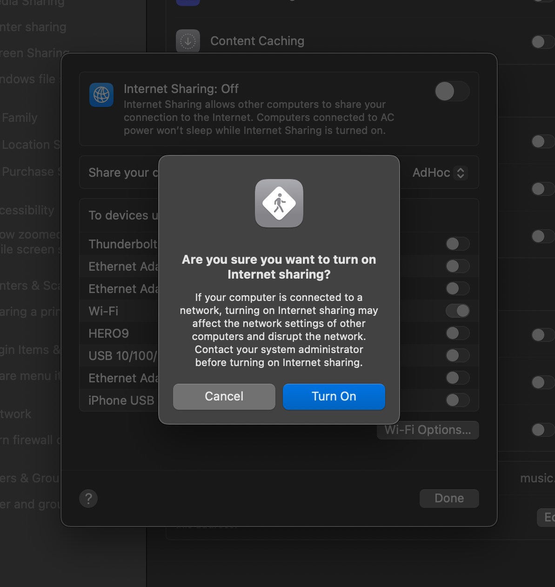
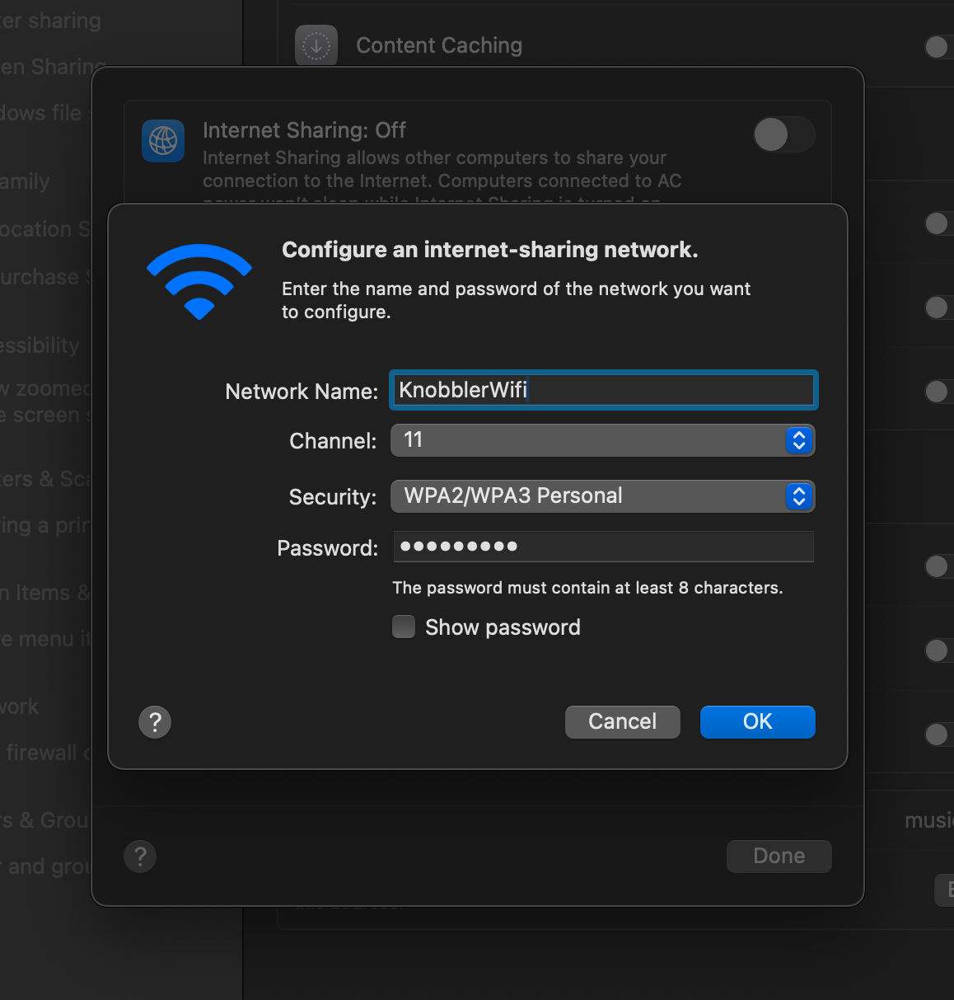
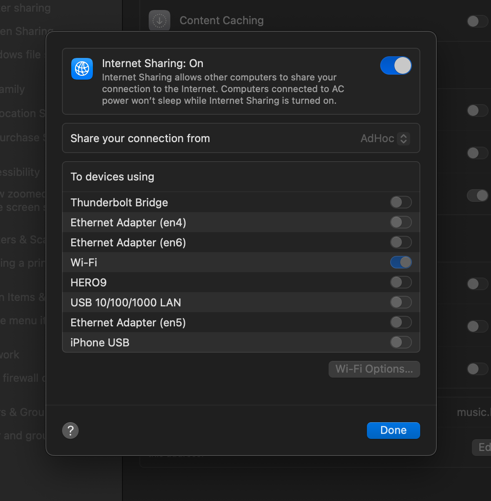
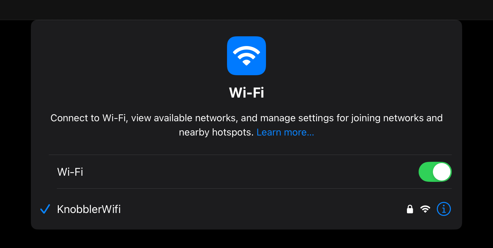
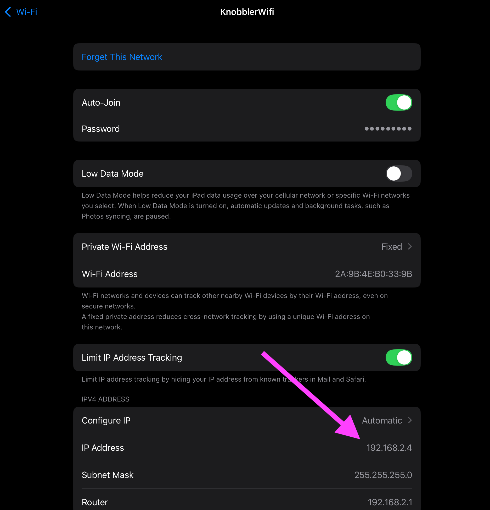
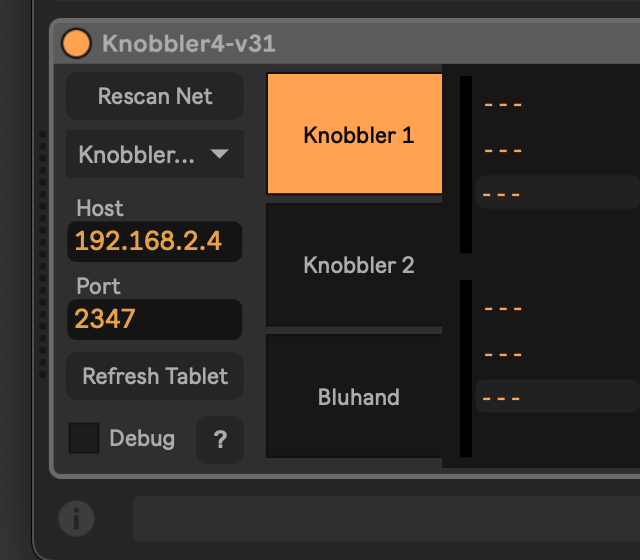
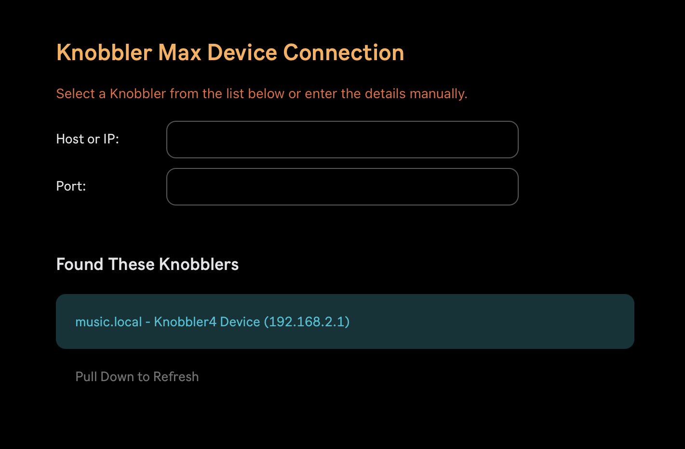
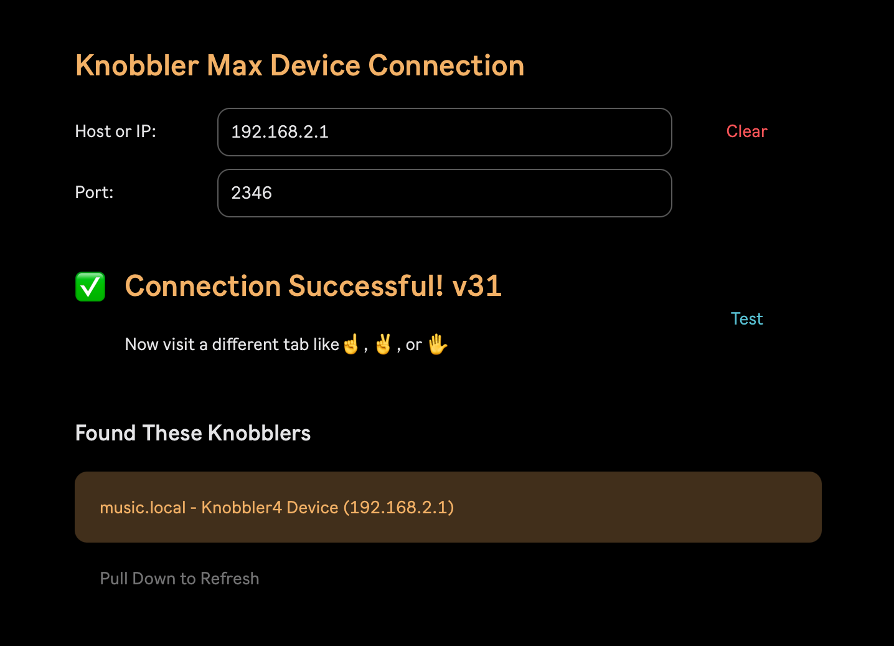

# Creating an Ad-Hoc WiFi Network

If you are in a place without a WiFi network to join such as a venue or practice space, you can create an ad-hoc WiFi network on your computer that your iPad can join.

These instructions are Mac-specific. If you have a Windows machine and can contribute instructions, please [let me know](mailto:zack@steinkamp.us).

> (originally from [this post on Mac StackExchage](https://apple.stackexchange.com/questions/464557/how-to-create-computer-to-computer-network-on-macos-sonoma-2023).)

1. Run the following commands, one-by-one in Terminal:

   ```
   sudo networksetup -createnetworkservice AdHoc lo0
   sudo networksetup -setmanual AdHoc 192.168.1.88 255.255.255.255
   sudo networksetup -setmanual AdHoc 127.0.0.1 255.255.255.255
   ```

2. Configure sharing settings:

   - Open System Settings
   - Navigate to Sharing
   - Select Internet Sharing (i)
   - Set "Share connection from" to "AdHoc"
   - Set "To devices using" to "Wifi"
     
   - Configure the new WiFi network with a name, channel, and password
     
   - Ensure Internet Sharing is switched On
     

3. Join the WiFi network you just created on your iPad
   

4. Tap the (i) icon next to the WiFi connection on your iPad and note the iPad's IP address. In the screenshot below, it is `192.168.2.4`
   

5. Add Knobbler to your Live Set and manually fill in the iPad's IP address.
   

6. Open the Knobbler app on the iPad and go to the Setup page. It should scan for and detect the device on the Mac.
   

7. Select your Mac in the "Found These Knobblers" section. You should get a "Connection Successful!" message.
   

8. ...

9. Profit!
